# Guide utilisateur par persona — Prospera Distributeur

> Ce guide parcourt l'application **persona par persona**. Pour chaque rôle, on documente
> **chaque écran auquel il a accès**, y compris les **onglets secondaires** et les **actions clés**
> (panier, création de proforma, clôture de visite…). Chaque écran est illustré par une **capture
> réelle** prise dans la peau du persona concerné, puis expliqué selon trois axes :
>
> - **But** — ce que l'écran est, ce qu'il montre.
> - **Objectif** — la décision ou le résultat qu'il vise pour ce persona.
> - **Workflow** — les étapes que le persona suit concrètement.

> ℹ️ **Données** : environnement de démonstration, montants en **FCFA** (`K` = millier, `M` = million,
> `Md` = milliard). Mot de passe démo commun : `password123`. Application : `http://localhost:3002`.

---

## Rappels transverses (valables pour tous les personas)

- **Périmètre** : chaque rôle ne voit que ses données. Les rôles « à portefeuille » (Commercial,
  Freelance, Prospection) ne voient **que leurs clients** (`commercial === utilisateur`) ; les rôles
  régionaux (Resp. Ventes, Superviseur) sont bornés à leur zone ; la direction voit le réseau.
- **Garde-fous** : plafond de crédit, plancher de trésorerie, remise maximale, exclusion des mauvais
  payeurs… La machine refuse de les franchir, même en mode automatique.
- **Trois niveaux de confiance de l'IA** : 🟢 *Automatique* (réversible, part seul) · 🟡 *À valider*
  (argent/remise/réputation en jeu, un clic) · 🔵 *Suggestion* (jugement humain requis).
- **Menu adaptatif** : les liens et leurs libellés changent selon le rôle ; des pastilles rouges
  signalent le travail en attente (relances critiques, commandes à valider, proformas expirantes…).

### Index des personas

| # | Persona | Rôle | Écrans documentés |
|---|---------|------|-------------------|
| 1 | [Directeur Général](#1--directeur-général-dg) | `DG` | 44 |
| 2 | [Directeur Commercial](#2--directeur-commercial-dc) | `DC` | 33 |
| 3 | [Responsable des Ventes](#3--responsable-des-ventes-resp_ventes) | `RESP_VENTES` | 21 |
| 4 | [Superviseur de Zone](#4--superviseur-de-zone-superviseur) | `SUPERVISEUR` | 16 |
| 5 | [Commercial Terrain](#5--commercial-terrain-commercial) | `COMMERCIAL` | 17 |
| 6 | [Commercial Freelance](#6--commercial-freelance-freelance) | `FREELANCE` | 13 |
| 7 | [Chargé de Prospection](#7--chargé-de-prospection-prospection) | `PROSPECTION` | 17 |
| 8 | [Responsable Stock & Logistique](#8--responsable-stock--logistique-resp_stock) | `RESP_STOCK` | 16 |
| 9 | [Gestionnaire Entrepôt](#9--gestionnaire-entrepôt-gest_entrepot) | `GEST_ENTREPOT` | 6 |
| 10 | [Directeur Administratif & Financier](#10--directeur-administratif--financier-daf) | `DAF` | 20 |
| 11 | [Comptable](#11--comptable-comptable) | `COMPTABLE` | 12 |
| 12 | [Responsable Marketing](#12--responsable-marketing-marketing) | `MARKETING` | 13 |
| 13 | [Responsable Recouvrement](#13--responsable-recouvrement-recouvrement) | `RECOUVREMENT` | 10 |

---

# 1 · Directeur Général (`DG`)

**Utilisateur démo** : Koffi Mensah · `dg@demo.prospera.tg` · **Périmètre** : réseau Togo, aucune
restriction. **Posture** : scanne les chiffres, arbitre, délègue — ne saisit rien. C'est le seul rôle
qui voit **tous** les modules. Son fil conducteur : *les chiffres qui engagent une décision*.

### 1.1 Tableau de bord — `/dashboard`

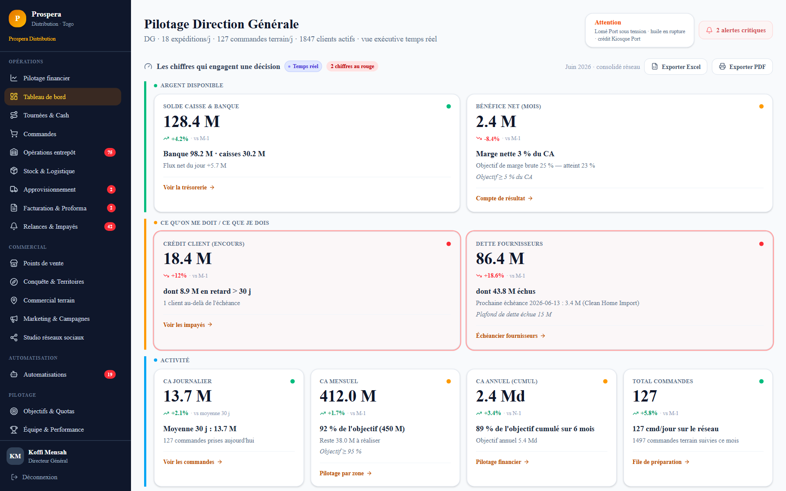

- **But** : la vue exécutive temps réel, organisée par question de décision (Argent disponible ·
  Ce qu'on me doit / ce que je dois · Activité) plutôt que par service.
- **Objectif** : voir en 10 secondes si la journée exige un arbitrage (alertes critiques, marge sous
  objectif, dette échue) et sauter directement sur la page concernée.
- **Workflow** : lire le bandeau des 8 chiffres → ouvrir une alerte critique → cliquer *Voir la
  trésorerie / les impayés / le compte de résultat* → exporter Excel/PDF pour le comité.

### 1.2 Pilotage financier — `/pilotage-financier`

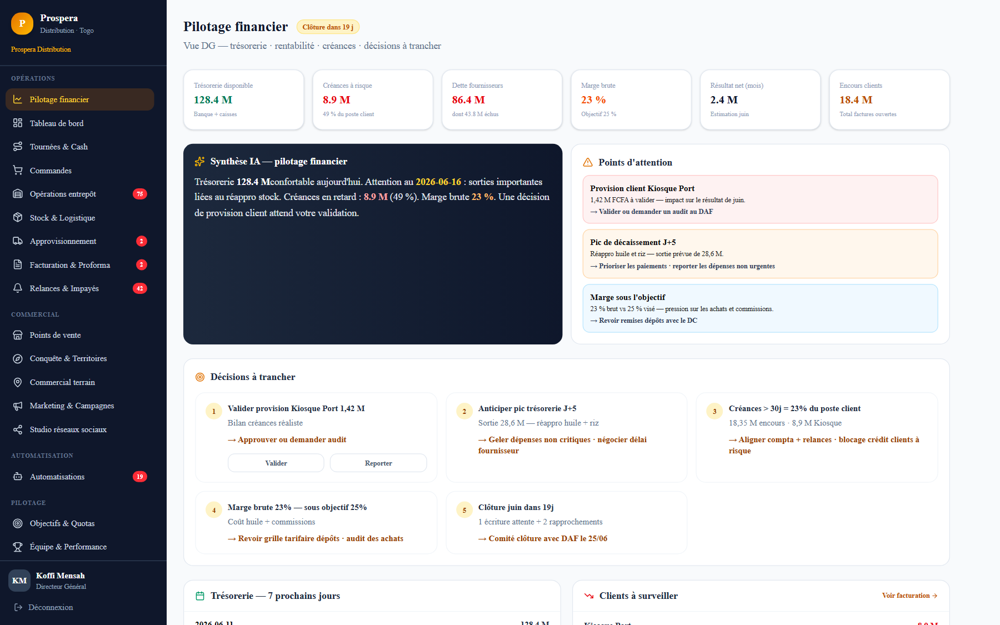

- **But** : trésorerie, rentabilité et créances, avec une **synthèse IA** et un bloc *Décisions à
  trancher* numéroté.
- **Objectif** : décider (valider une provision, anticiper un pic de décaissement, aligner
  compta + relances) sans attendre la clôture.
- **Workflow** : lire la synthèse IA → parcourir les décisions à trancher → *Valider* ou *Reporter*
  → vérifier la projection de trésorerie à 7 jours et les clients à surveiller.

### 1.3 Tournées & Cash — `/tournees`

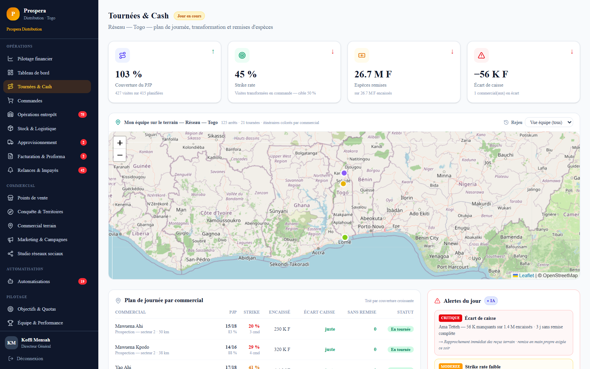

- **But** : plan de journée des équipes, strike rate, espèces remises et **écart de caisse**, sur carte.
- **Objectif** : détecter une anomalie d'exécution ou de caisse (premier signal de fraude) et la traiter.
- **Workflow** : filtrer par équipe → repérer un écart de caisse rouge → déclencher le rapprochement.

### 1.4 Commandes — `/commandes`

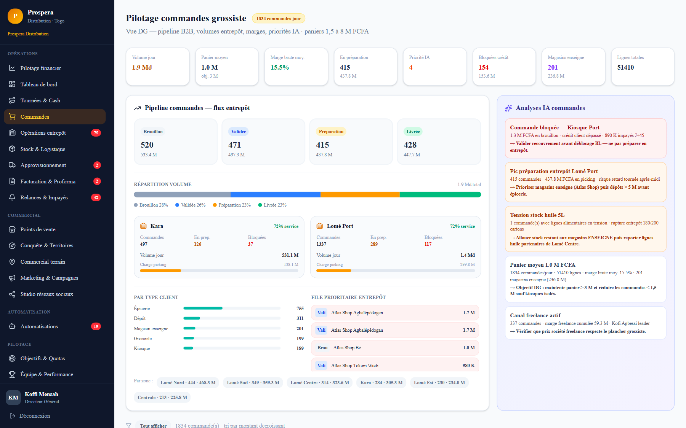

- **But** : pilotage du carnet de commandes grossiste (pipeline Brouillon → Livrée, flux par entrepôt,
  commandes bloquées crédit).
- **Objectif** : fluidifier le passage commande → préparation → livraison et débloquer ce qui coince.
- **Workflow** : lire les KPI → suivre le pipeline → traiter les analyses IA (commande bloquée,
  tension produit) → filtrer par zone/entrepôt.

### 1.5 Opérations entrepôt — `/entrepot`

Le poste de travail physique de l'entrepôt, en 4 onglets. Le DG y entre pour superviser.

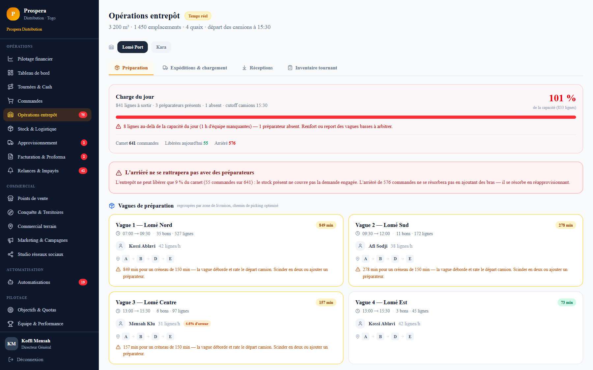

- **But (Préparation)** : la charge du jour (lignes à sortir vs capacité) et les vagues de picking
  optimisées par zone.
- **Objectif** : voir si l'entrepôt tient le départ camion de 15 h 30 et arbitrer les vagues en surcharge.
- **Workflow** : lire la jauge de charge → repérer une vague qui déborde → scinder ou renforcer.

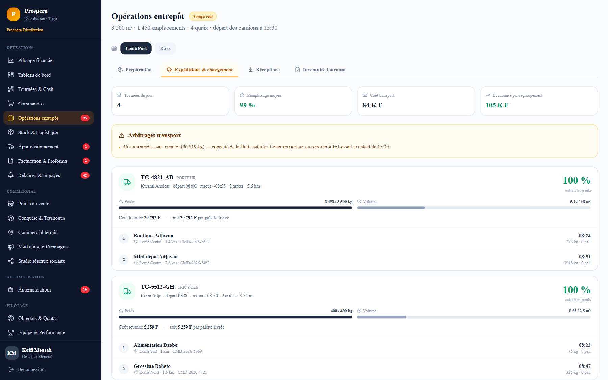

- **But (Expéditions)** : les tournées de livraison et le chargement des camions.
- **Objectif** : garantir que les bons de livraison partent dans le bon camion, à l'heure.
- **Workflow** : suivre les expéditions → contrôler le remplissage → valider le chargement.

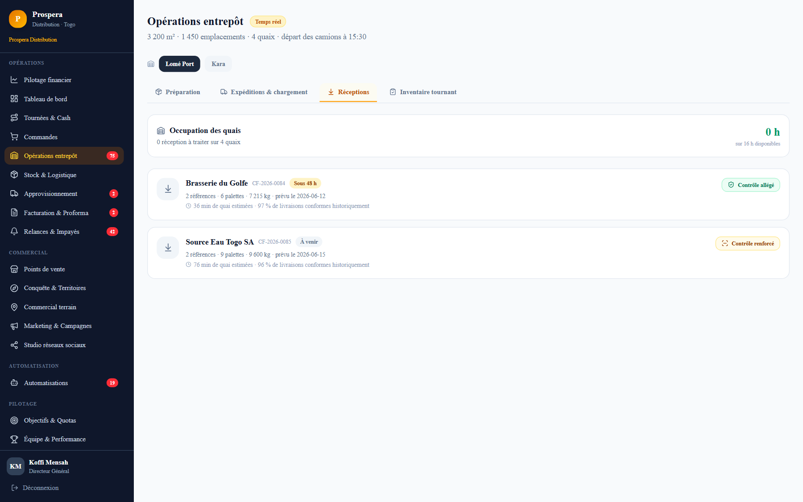

- **But (Réceptions)** : les livraisons fournisseurs attendues au quai.
- **Objectif** : réceptionner et signaler les écarts (base de la dette réelle).
- **Workflow** : ouvrir une réception attendue → saisir les quantités reçues → ouvrir un litige si écart.

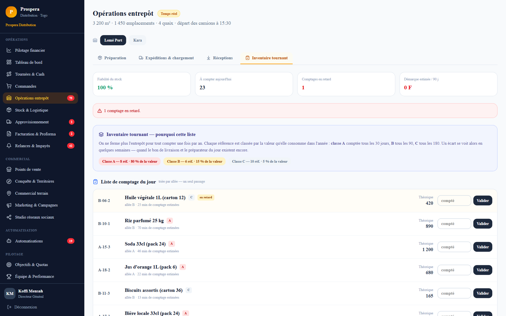

- **But (Inventaire)** : les comptages tournants du jour.
- **Objectif** : maintenir la fiabilité du stock sans arrêter l'activité.
- **Workflow** : prendre les emplacements à compter → saisir le comptage → traiter les écarts.

### 1.6 Stock & Logistique — `/stock`

Vue réseau complète (le DG voit la marge), en 6 onglets.

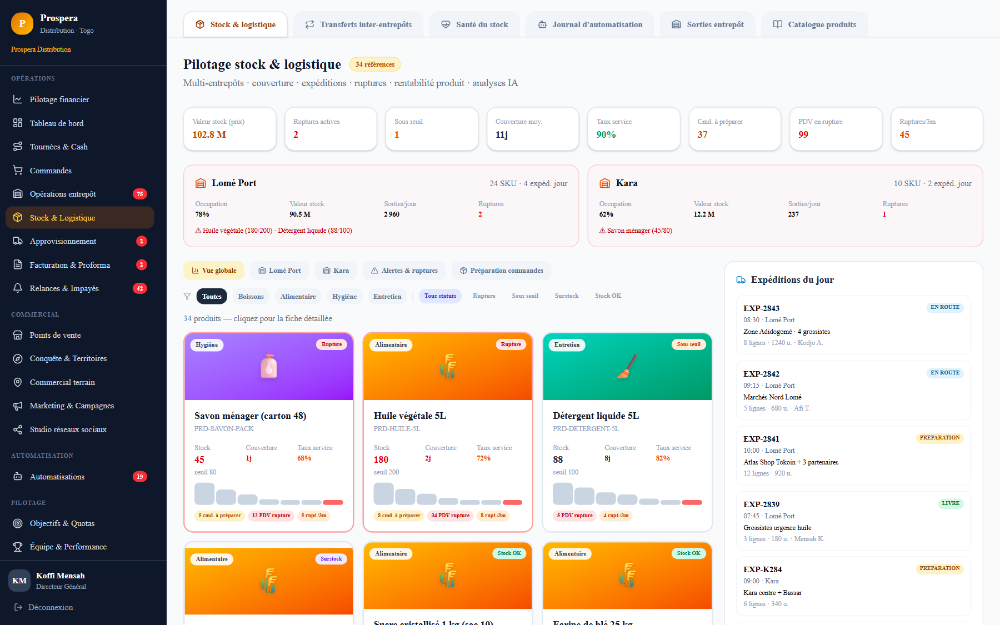

- **But** : pilotage multi-entrepôts (valeur de stock, ruptures, couverture, taux de service) avec
  fiches produit.
- **Objectif** : repérer ruptures et surstocks qui pénalisent la vente ou immobilisent la trésorerie.
- **Workflow** : lire les KPI → filtrer par entrepôt / alertes → ouvrir une fiche produit.

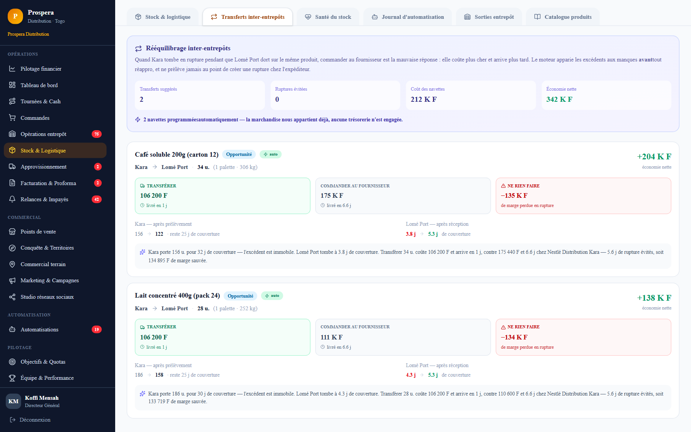

- **But** : rééquilibrer le stock entre Lomé Port et Kara.
- **Objectif** : éviter une rupture d'un côté quand l'autre est en surstock.
- **Workflow** : repérer un déséquilibre → arbitrer un transfert.

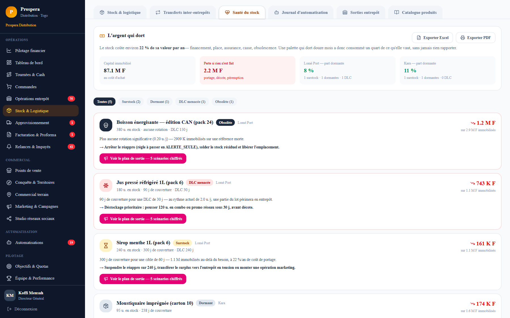

- **But** : « L'argent qui dort » — capital immobilisé, surstock, DLC menacées, obsolètes.
- **Objectif** : déclencher un plan de sortie avant décote/péremption.
- **Workflow** : filtrer (surstock / dormant / DLC / obsolète) → *Voir le plan de sortie* (5 scénarios chiffrés).

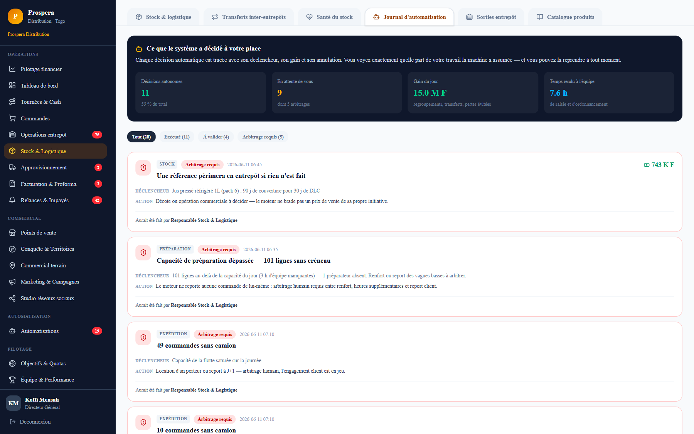

- **But** : la trace de ce que le moteur logistique a décidé seul.
- **Objectif** : auditer et garder la main sur l'automatisation.
- **Workflow** : parcourir les déclenchements → annuler/ajuster si besoin.

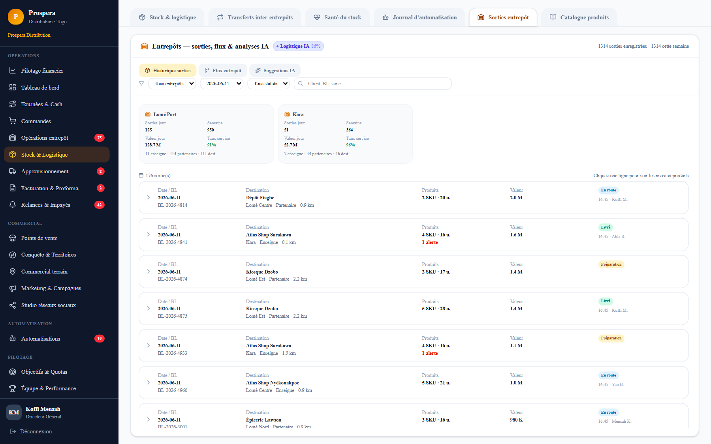

- **But** : historique des sorties par entrepôt.
- **Objectif** : comprendre la dynamique de sortie (produits, volumes).
- **Workflow** : filtrer par entrepôt/période → analyser.

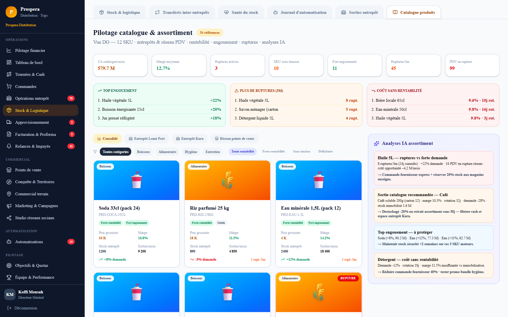

- **But** : le référentiel des SKU.
- **Objectif** : disposer d'une source unique produit (prix, packaging, catégorie).
- **Workflow** : rechercher une référence → consulter sa fiche.

### 1.7 Approvisionnement — `/approvisionnement`

Réappro assisté par IA et relation fournisseurs, en 4 onglets.

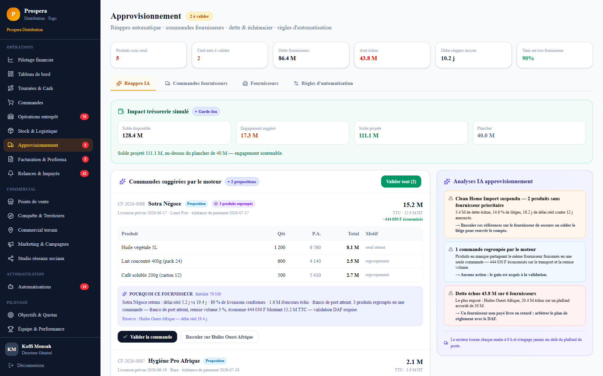

- **But** : commandes fournisseurs suggérées par le moteur (produits regroupés, franco de port,
  garde-fou trésorerie).
- **Objectif** : réapprovisionner sans mettre la caisse sous le plancher.
- **Workflow** : lire l'impact trésorerie → *Valider* / *Basculer sur fournisseur de secours*.

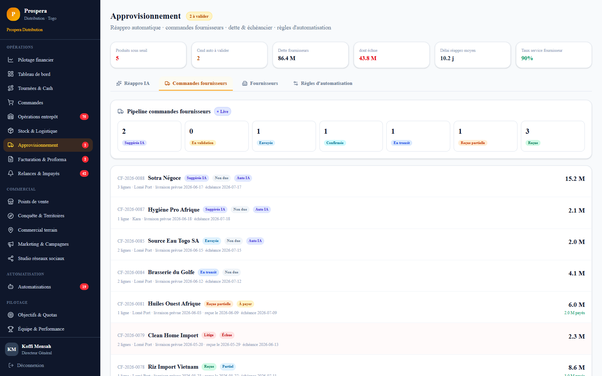

- **But** : le carnet de commandes d'achat et leur suivi.
- **Objectif** : suivre l'engagement en cours et les réceptions.
- **Workflow** : ouvrir une commande → suivre son statut.

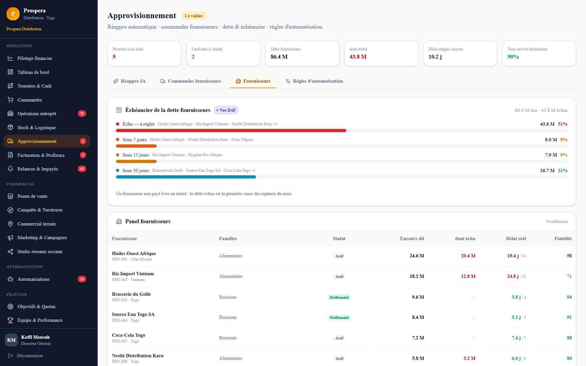

- **But** : la fiche fournisseur (fiabilité, délai réel, encours de dette, échéancier).
- **Objectif** : arbitrer avec qui commander et quoi payer.
- **Workflow** : comparer les fournisseurs → consulter l'échéancier.

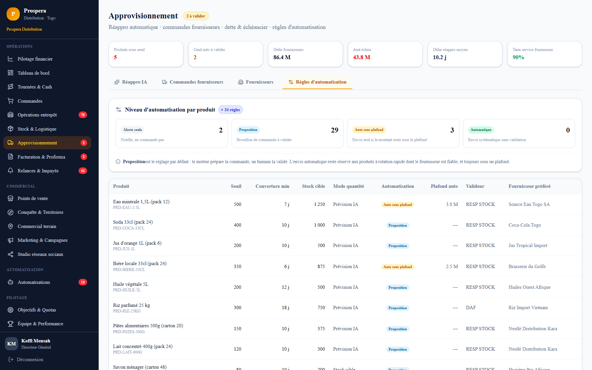

- **But** : les règles de réappro par produit (seuil, couverture, mode de quantité, plafond, valideur).
- **Objectif** : cadrer ce que le moteur peut engager seul.
- **Workflow** : ouvrir une règle → ajuster seuil/plafond/niveau d'automatisation.

### 1.8 Facturation & Créances — `/facturation`

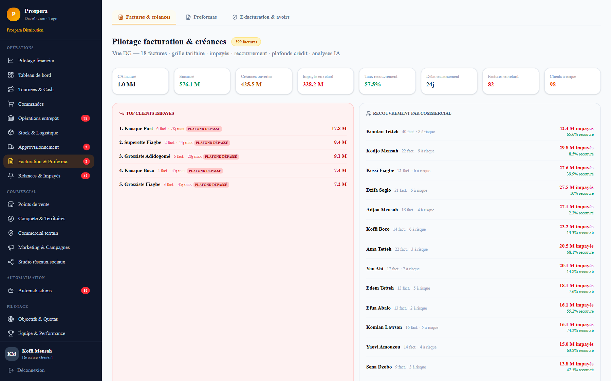

- **But** : pilotage des créances (CA facturé, encaissé, impayés en retard, top clients impayés,
  recouvrement par commercial).
- **Objectif** : voir où est l'argent non rentré et qui doit le récupérer.
- **Workflow** : lire les KPI → repérer les plafonds dépassés → renvoyer vers relances.

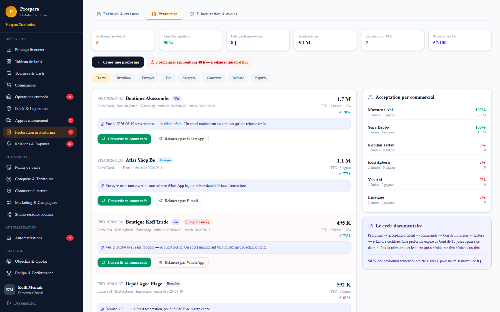

- **But** : les devis proforma et leur taux d'acceptation.
- **Objectif** : suivre la transformation devis → commande.
- **Workflow** : filtrer → ouvrir une proforma → convertir/relancer.

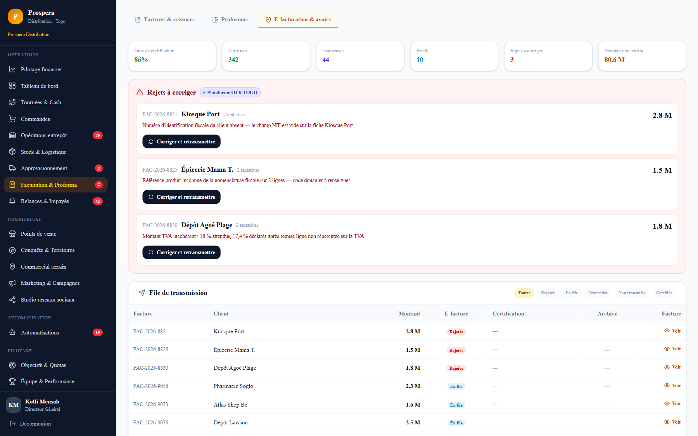

- **But** : file de transmission e-facture (certification OTR, rejets, archive légale).
- **Objectif** : garantir la conformité fiscale des factures.
- **Workflow** : suivre la certification → corriger les rejets.

### 1.9 Relances & Impayés — `/relances`

Pipeline multi-canal, 4 flux.

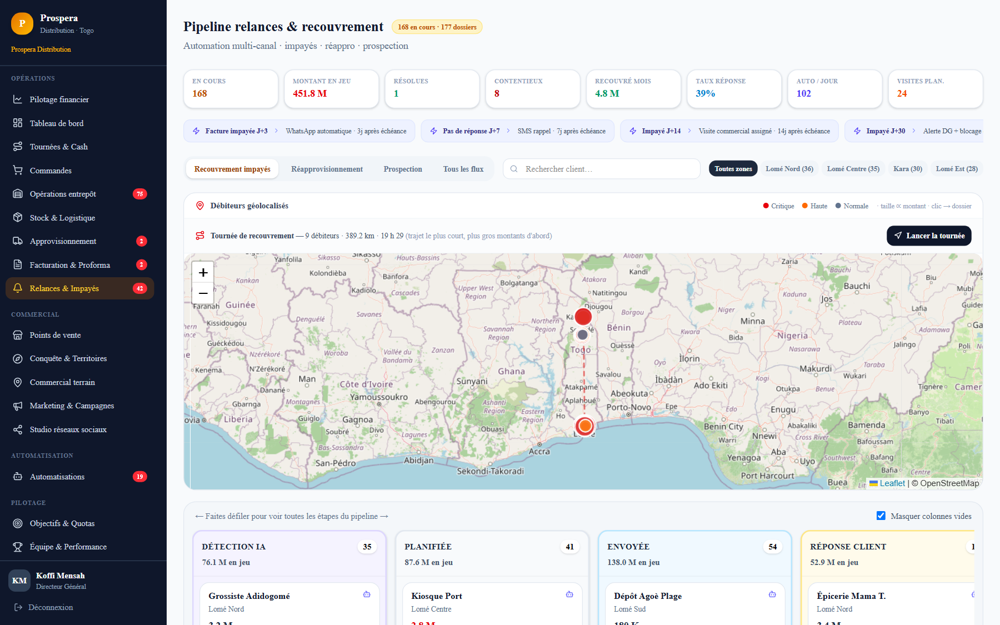

- **But** : le pipeline de recouvrement (détection → planifiée → envoyée → réponse), carte des débiteurs.
- **Objectif** : récupérer le cash avec le bon canal au bon moment.
- **Workflow** : suivre les colonnes du pipeline → lancer la tournée de recouvrement.

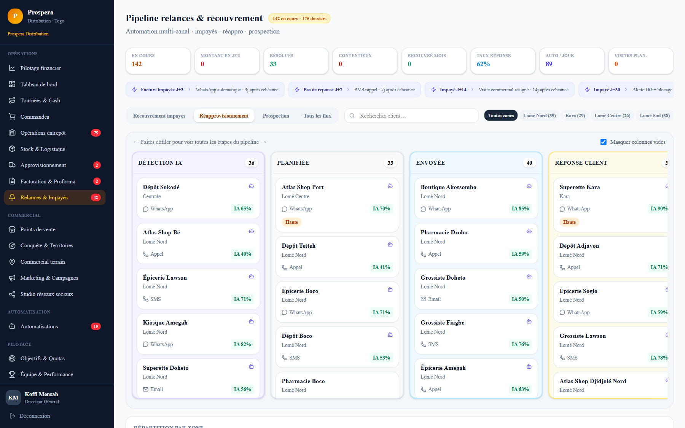

- **But** : le flux de relances liées au réapprovisionnement.
- **Objectif** : relancer ce qui bloque la disponibilité.
- **Workflow** : basculer sur l'onglet → traiter les dossiers.

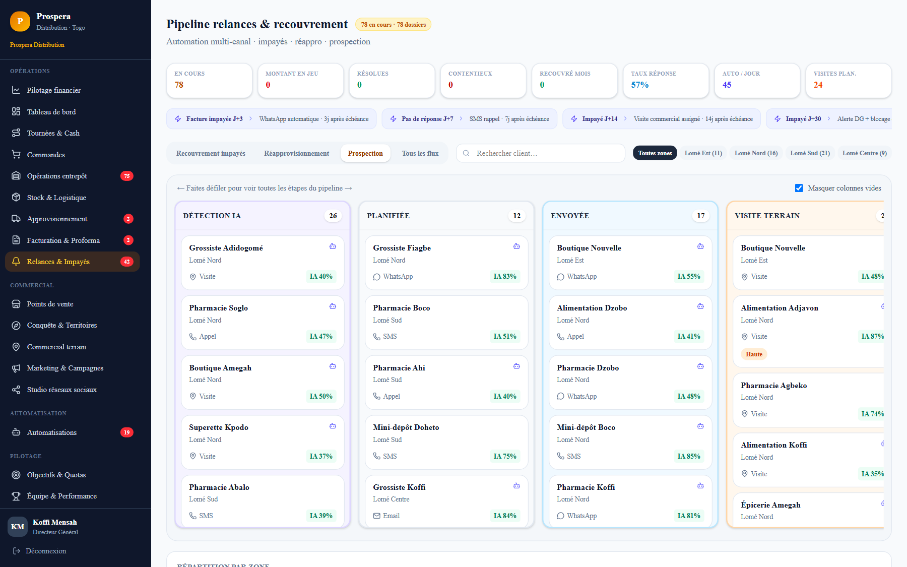

- **But** : le flux de relances de prospection.
- **Objectif** : ne pas laisser refroidir les leads.
- **Workflow** : parcourir → relancer.

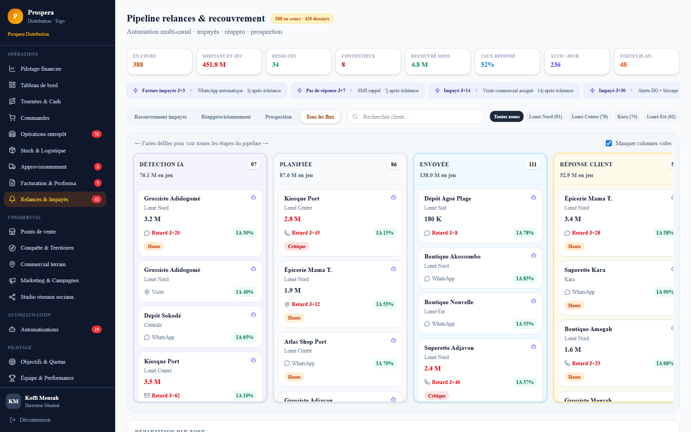

- **But** : la vue consolidée de tous les flux de relance.
- **Objectif** : avoir la charge de relance totale d'un coup d'œil.
- **Workflow** : filtrer par zone → prioriser.

### 1.10 Points de vente — `/points-de-vente`

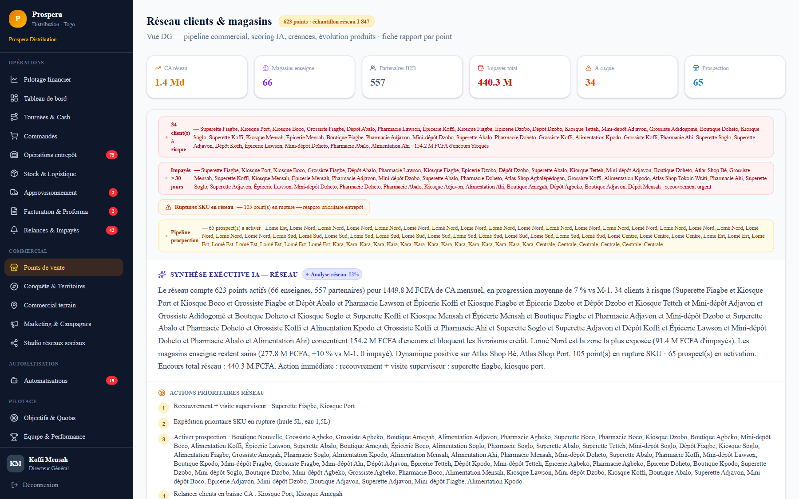

- **But** : le CRM réseau (CA, magasins enseigne, partenaires B2B, impayés, clients à risque) avec
  synthèse IA et actions prioritaires.
- **Objectif** : savoir où concentrer l'effort commercial et de recouvrement.
- **Workflow** : lire la synthèse → parcourir les actions prioritaires → ouvrir une fiche.

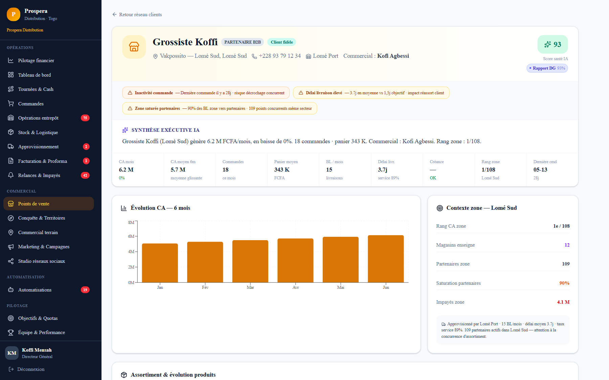

- **But** : la fiche complète d'un client (score de santé, alertes, évolution CA, contexte zone).
- **Objectif** : comprendre un compte avant d'agir.
- **Workflow** : ouvrir la fiche → lire la synthèse IA → décider (relance, visite, déblocage).

### 1.11 Conquête & Territoires — `/prospection`

4 onglets suivant le cycle de conquête.

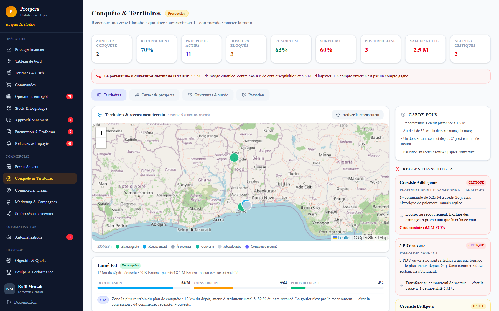

- **But** : la carte des territoires et le recensement des zones blanches.
- **Objectif** : piloter l'expansion géographique.
- **Workflow** : lire la carte → activer un recensement.

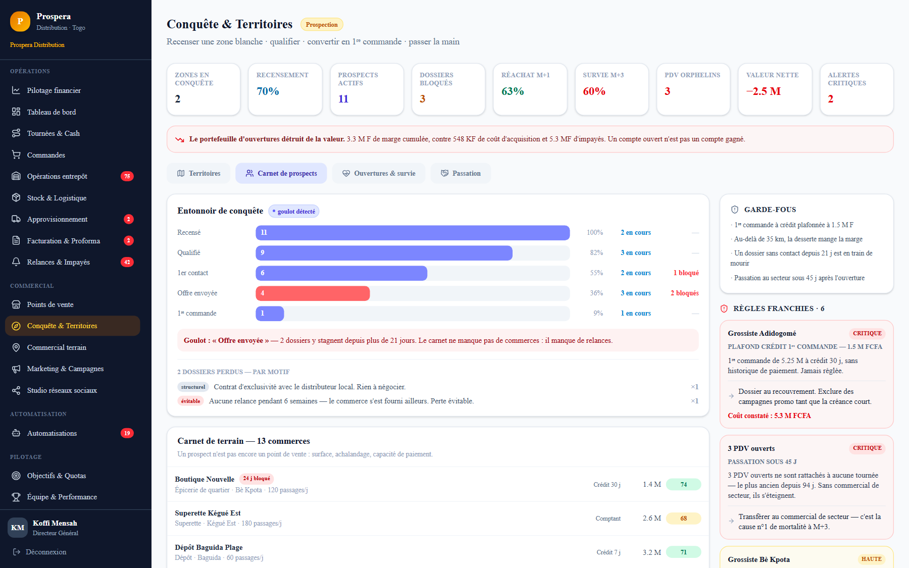

- **But** : l'entonnoir de conquête et le carnet de commerces qualifiés.
- **Objectif** : voir où le travail est en panne (goulot).
- **Workflow** : lire l'entonnoir → traiter les dossiers bloqués.

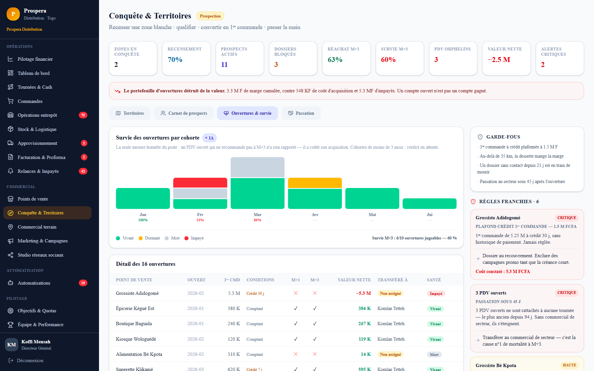

- **But** : la survie des ouvertures (cohortes vivant/dormant/mort/impayé) et la valeur nette.
- **Objectif** : mesurer si les comptes ouverts créent de la valeur.
- **Workflow** : analyser les cohortes → repérer les ouvertures qui meurent.

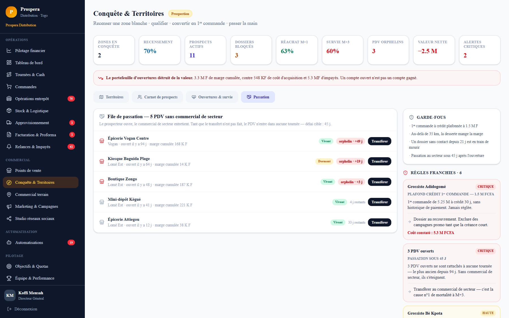

- **But** : les PDV ouverts que plus personne ne visite.
- **Objectif** : éviter la mortalité par défaut de passation.
- **Workflow** : repérer les orphelins → transférer au commercial de secteur.

### 1.12 Commercial terrain — `/commercial`

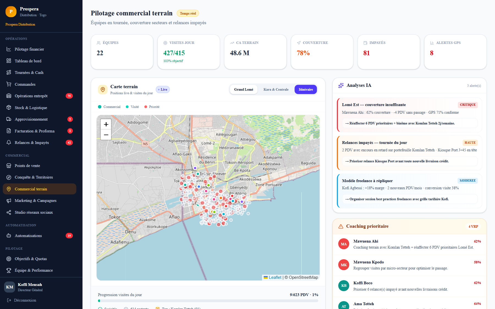

- **But** : la supervision GPS de toute la force de vente (positions, couverture, coaching).
- **Objectif** : piloter l'exécution terrain et le coaching.
- **Workflow** : lire la carte → traiter les analyses IA → prioriser le coaching.

### 1.13 Marketing & Campagnes — `/marketing`

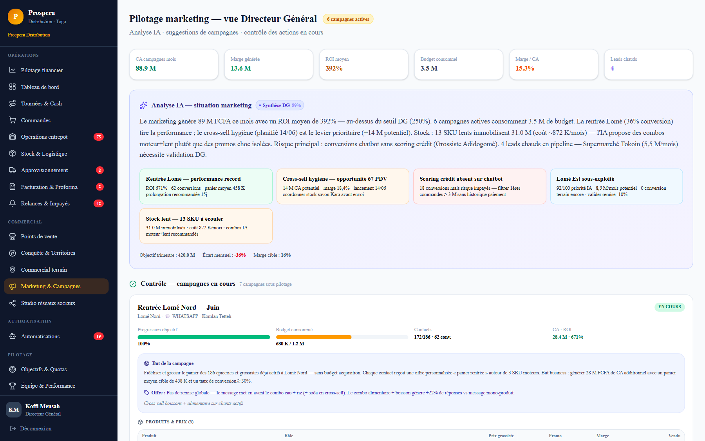

- **But** : la vue DG du marketing (contrôle des campagnes, ROI, combos d'écoulement, décisions).
- **Objectif** : arbitrer le marketing sans le produire.
- **Workflow** : lire l'analyse IA → contrôler les campagnes → trancher les 5 décisions.

### 1.14 Studio réseaux sociaux — `/marketing/social`

5 onglets.

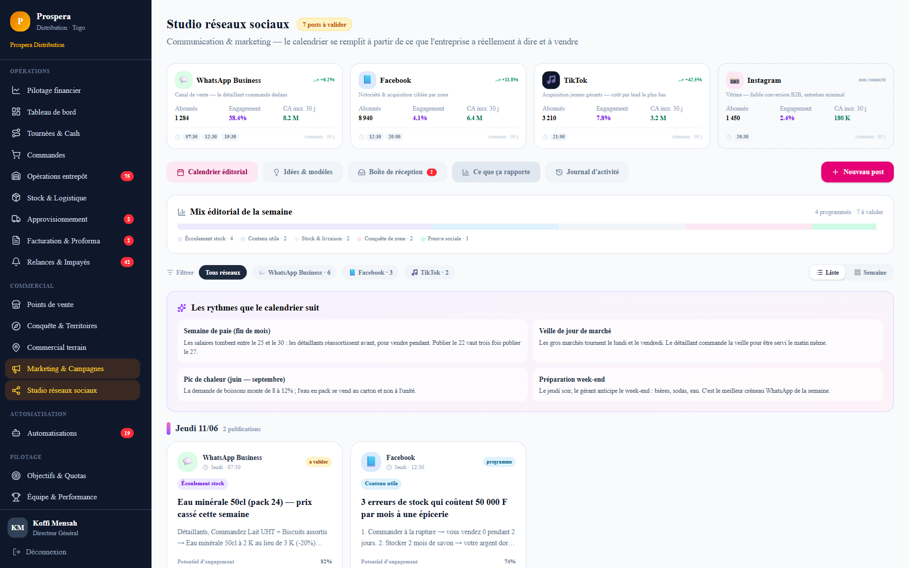

- **But** : le calendrier éditorial multi-réseaux (WhatsApp, Facebook, TikTok, Instagram).
- **Objectif** : superviser ce qui part au nom de l'entreprise.
- **Workflow** : parcourir le calendrier → valider/ajourner un post.

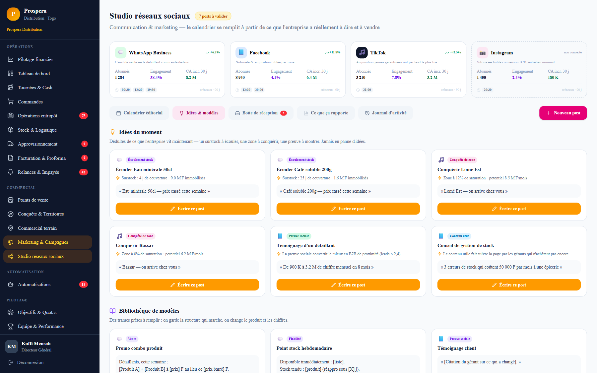

- **But** : les idées de contenu issues du terrain et les modèles.
- **Objectif** : nourrir le calendrier.
- **Workflow** : choisir une idée/modèle → l'ajouter au calendrier.

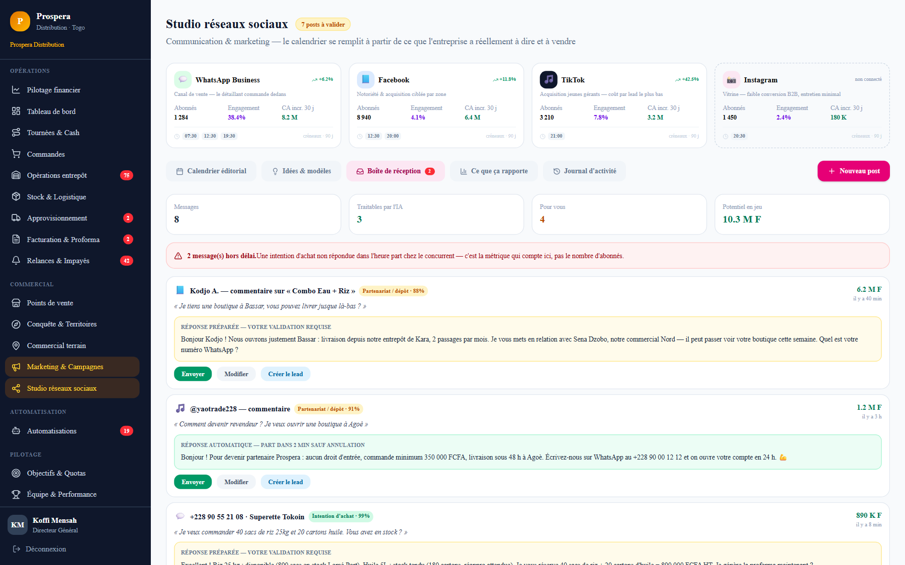

- **But** : les messages entrants des réseaux (leads, commandes).
- **Objectif** : ne pas rater une demande commerciale.
- **Workflow** : traiter la boîte → convertir un message en lead.

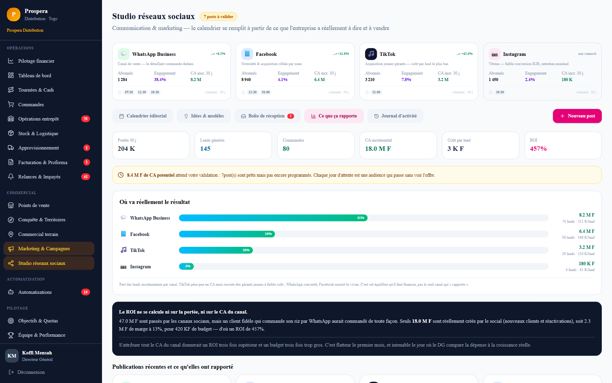

- **But** : la performance des réseaux (portée, engagement, CA attribué).
- **Objectif** : mesurer le ROI social.
- **Workflow** : lire les indicateurs par réseau.

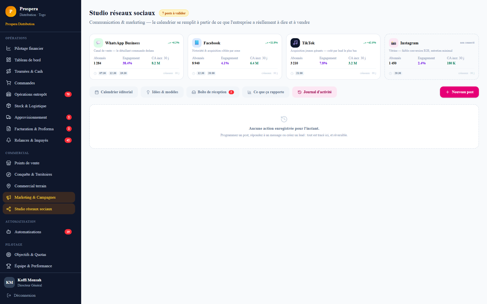

- **But** : la trace horodatée et annulable de chaque décision du studio.
- **Objectif** : auditer l'activité social media.
- **Workflow** : parcourir le journal → annuler une action.

### 1.15 Automatisations — `/automatisations`

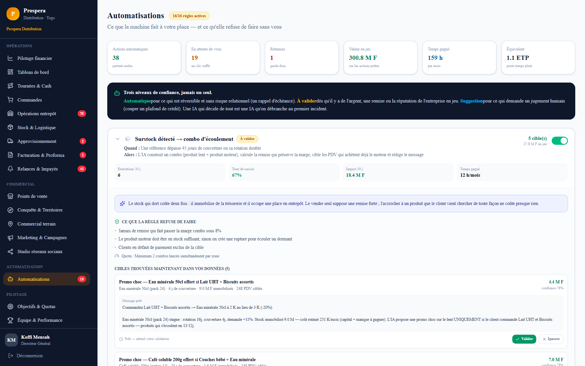

- **But** : le centre de contrôle du moteur d'IA (actions parties seules, en attente, retenues).
- **Objectif** : garder la maîtrise de ce que la machine fait à sa place.
- **Workflow** : lire les compteurs → ouvrir une règle → *Valider / Ignorer* les cibles.

### 1.16 Objectifs & Quotas — `/objectifs`

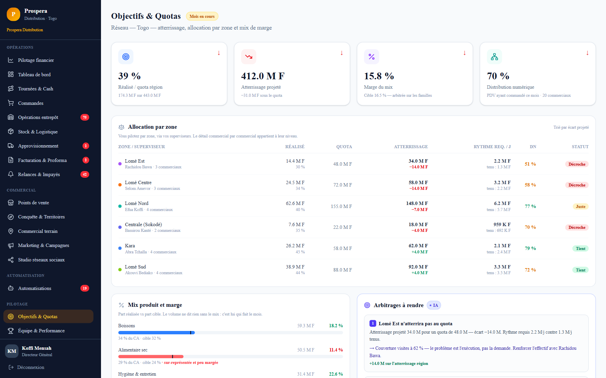

- **But** : l'allocation du quota par zone, l'atterrissage projeté et le mix de marge.
- **Objectif** : arbitrer l'atterrissage région au niveau du réseau.
- **Workflow** : lire l'allocation par zone → traiter les arbitrages IA.

### 1.17 Équipe & Performance — `/equipe`

3 onglets.

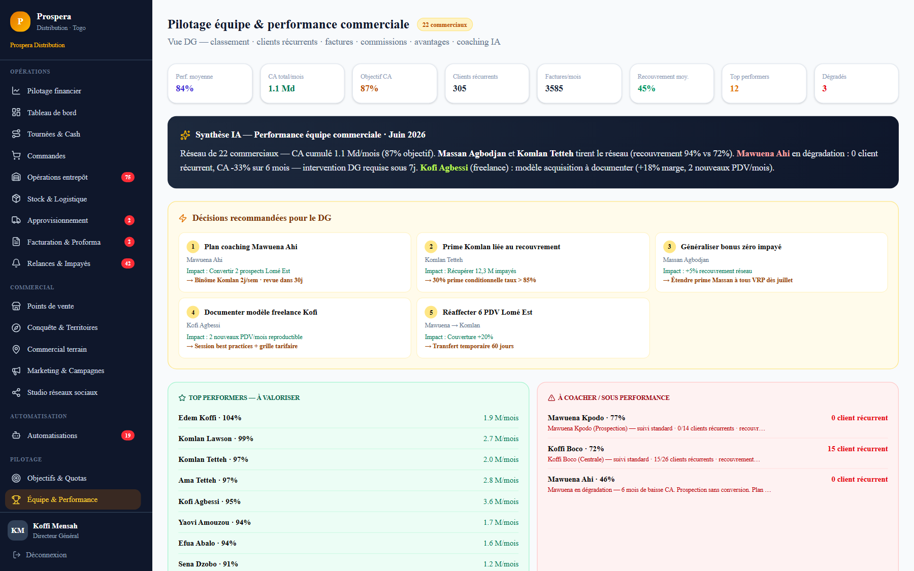

- **But** : la performance commerciale (synthèse IA, top performers, à coacher, décisions DG).
- **Objectif** : valoriser et coacher les bonnes personnes.
- **Workflow** : lire la synthèse → parcourir les classements → ouvrir une fiche.

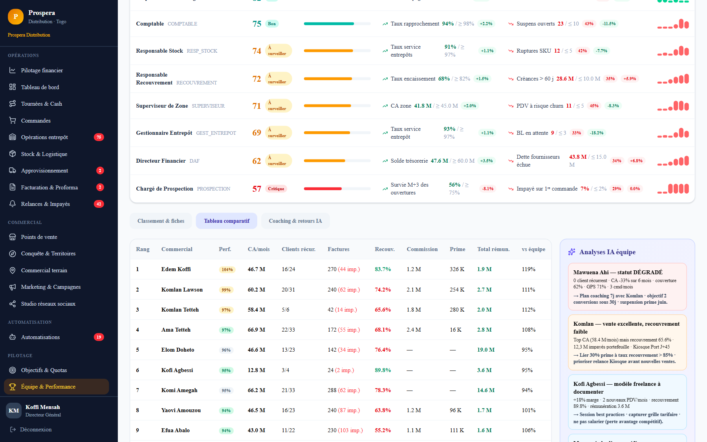

- **But** : la comparaison chiffrée des commerciaux.
- **Objectif** : objectiver les écarts de performance.
- **Workflow** : trier les colonnes → repérer les écarts.

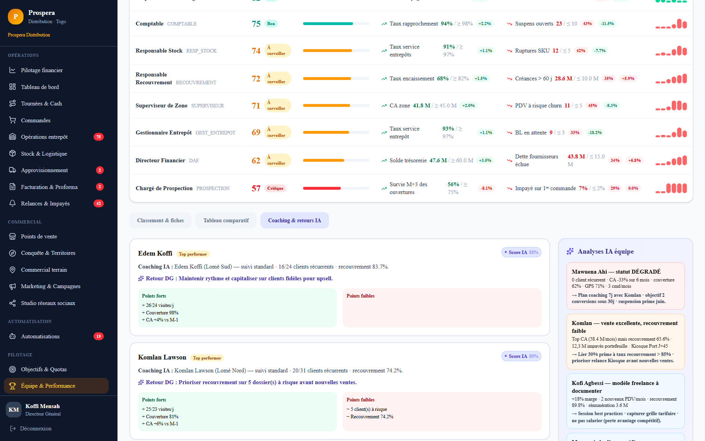

- **But** : les recommandations de coaching par l'IA.
- **Objectif** : transformer la donnée en plan d'action RH.
- **Workflow** : lire les retours → décider un plan de coaching.

### 1.18 Comptabilité — `/comptabilite`

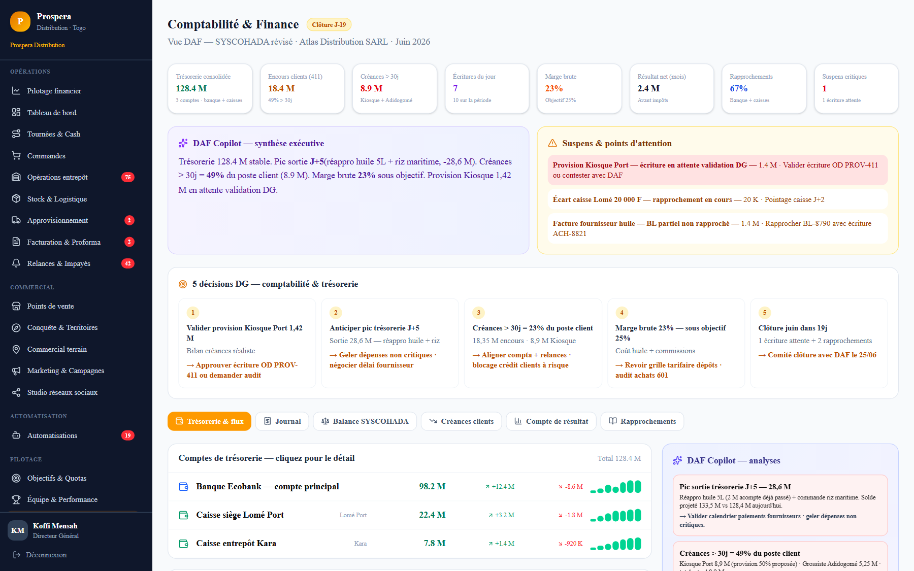

- **But** : la vue analytique comptable (trésorerie, balance SYSCOHADA, créances 411, résultat).
- **Objectif** : suivre la santé comptable et la clôture.
- **Workflow** : parcourir les onglets (trésorerie, journal, balance, créances, résultat, rapprochements).

---

# 2 · Directeur Commercial (`DC`)

**Utilisateur démo** : Ama Dzobo · `dc@demo.prospera.tg` · **Périmètre** : toutes zones commerciales.
**Posture** : pilote la force de vente et le chiffre (objectifs, tournées, couverture, marge). Il voit
presque tout, sauf ce qui est purement financier au DG. Contrairement au DG, son écran marketing est
la **vue opérateur**.

### 2.1 Tableau de bord — `/dashboard`

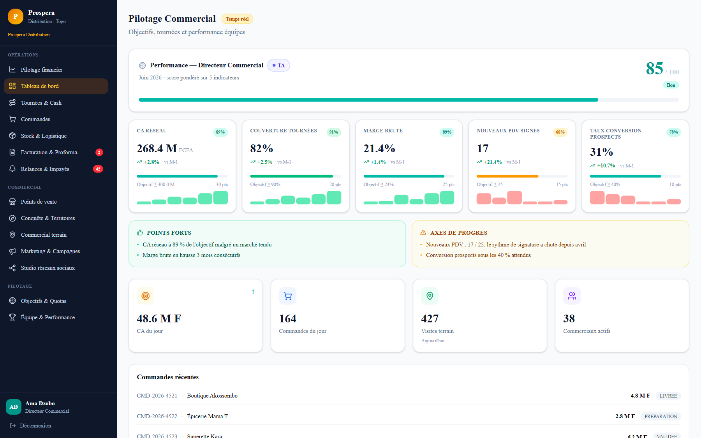

- **But** : cockpit « Pilotage Commercial » (CA du jour, commandes, visites, commerciaux actifs).
- **Objectif** : suivre l'activité commerciale consolidée du jour.
- **Workflow** : lire les KPI et les commandes récentes → basculer vers l'écran d'action concerné.

### 2.2 Pilotage financier — `/pilotage-financier`

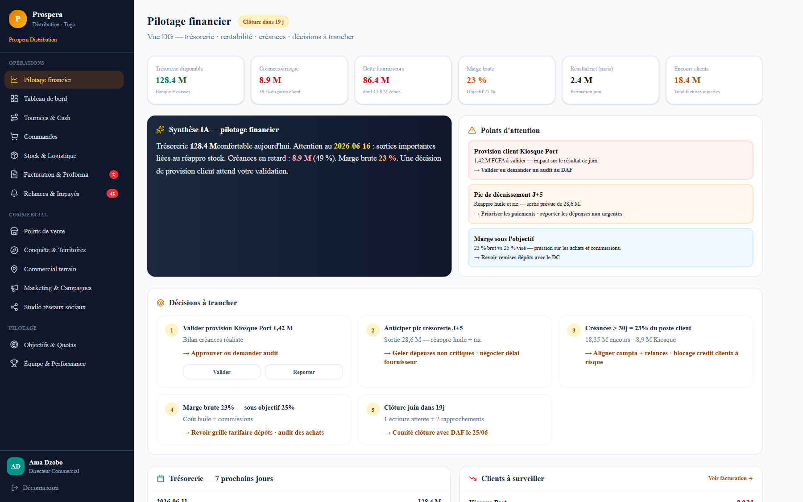

- **But** : trésorerie, créances et rentabilité (accès partagé avec le DG/DAF).
- **Objectif** : relier ses décisions commerciales à leur impact cash et marge.
- **Workflow** : lire la synthèse → surveiller créances à risque et marge.

### 2.3 Tournées & Cash — `/tournees`

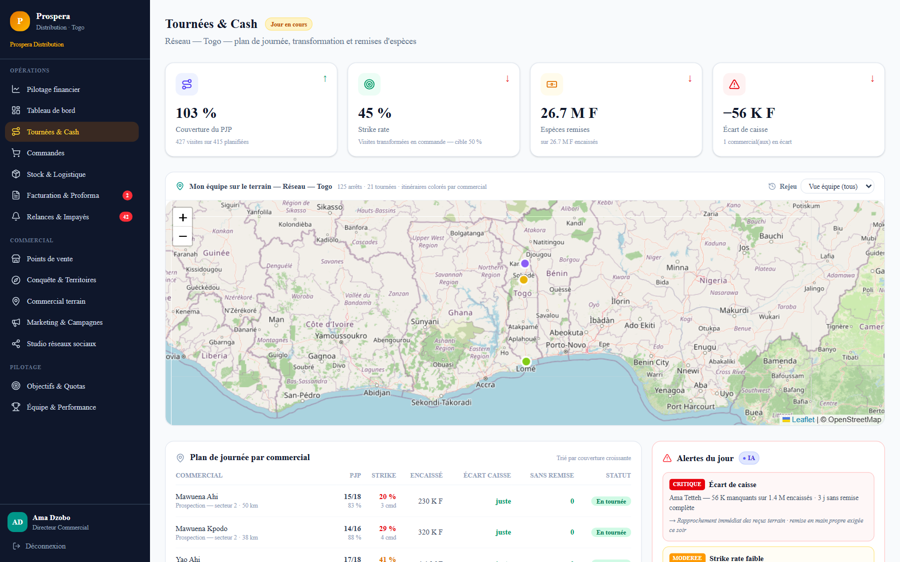

- **But** : exécution terrain et caisse par équipe.
- **Objectif** : garantir couverture PJP, strike rate et remises d'espèces.
- **Workflow** : filtrer par équipe → traiter alertes de caisse et de couverture.

### 2.4 Commandes — `/commandes`

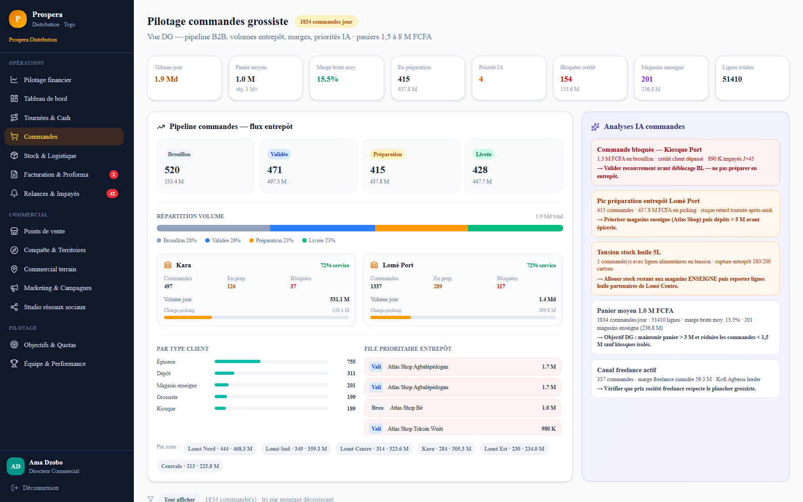

- **But** : pilotage du carnet de commandes (identique à la vue DG).
- **Objectif** : fluidifier le flux et débloquer les commandes bloquées crédit.
- **Workflow** : suivre le pipeline → traiter les analyses IA → filtrer zone/entrepôt.

### 2.5 Stock & Logistique — `/stock` (6 onglets)

Le DC consulte le stock pour ne pas promettre ce qui manque ; il a la vue complète avec marge.


- **But / Objectif / Workflow** : disponibilité et ruptures réseau → éviter les promesses intenables → lire KPI, filtrer, ouvrir une fiche produit.

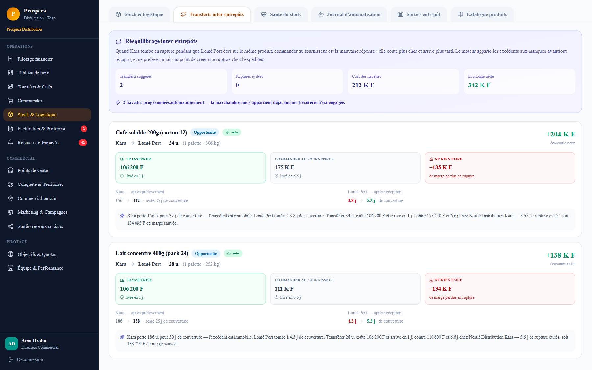
- **But / Objectif / Workflow** : rééquilibrage entre entrepôts → limiter les ruptures locales → repérer un déséquilibre, arbitrer.

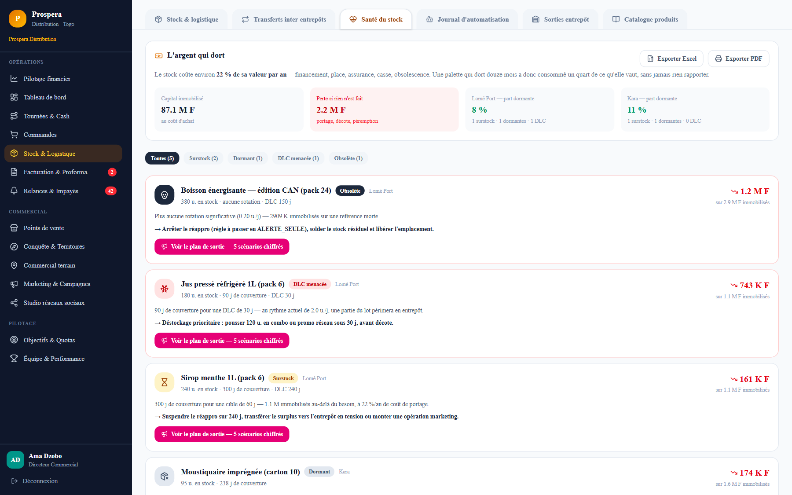
- **But / Objectif / Workflow** : capital dormant / surstock → alimenter des opérations commerciales d'écoulement → filtrer et déclencher un plan de sortie.


- **But / Objectif / Workflow** : trace des décisions logistiques auto → audit → parcourir, ajuster.


- **But / Objectif / Workflow** : historique des sorties → comprendre la dynamique produit → filtrer/analyser.


- **But / Objectif / Workflow** : référentiel SKU → source produit unique → rechercher une référence.

### 2.6 Facturation & Créances — `/facturation` (2 onglets)


- **But / Objectif / Workflow** : créances de sa force de vente, grille tarifaire, clients à risque → suivre l'argent non rentré → lire KPI, renvoyer vers relances.


- **But / Objectif / Workflow** : proformas de toute la force de vente + taux d'acceptation par commercial → suivre la transformation devis→commande → filtrer, convertir, relancer.

### 2.7 Relances & Impayés — `/relances` (4 flux)


- **But / Objectif / Workflow** : pipeline de recouvrement → arbitrer les impayés qui bloquent des commandes → suivre les colonnes, lancer la tournée.


- **But / Objectif / Workflow** : flux réappro → débloquer la disponibilité → traiter les dossiers.


- **But / Objectif / Workflow** : flux prospection → ne pas laisser refroidir les leads → relancer.


- **But / Objectif / Workflow** : vue consolidée → charge de relance totale → filtrer par zone, prioriser.

### 2.8 Points de vente — `/points-de-vente`


- **But / Objectif / Workflow** : CRM réseau complet → concentrer l'effort commercial → lire synthèse, ouvrir une fiche.


- **But / Objectif / Workflow** : fiche client 360° → comprendre un compte avant d'agir → lire la synthèse IA, décider.

### 2.9 Conquête & Territoires — `/prospection` (4 onglets)


- **But / Objectif / Workflow** : carte des territoires → piloter l'expansion → activer un recensement.


- **But / Objectif / Workflow** : entonnoir de conquête → identifier le goulot → traiter les dossiers bloqués.


- **But / Objectif / Workflow** : survie des ouvertures → mesurer la création de valeur → analyser les cohortes.


- **But / Objectif / Workflow** : PDV orphelins → éviter la mortalité par défaut → transférer au secteur.

### 2.10 Commercial terrain — `/commercial`


- **But / Objectif / Workflow** : supervision GPS de l'équipe → piloter exécution & coaching → lire la carte, prioriser le coaching. **C'est l'écran central du DC.**

### 2.11 Marketing & prospection (opérations) — `/marketing`


- **But / Objectif / Workflow** : vue **opérateur** (campagnes, pipeline leads, segmentation IA, zones blanches, combos) → piloter la génération de demande → lancer/valider un combo, suivre le ROI.

### 2.12 Studio réseaux sociaux — `/marketing/social` (5 onglets)


- **But / Objectif / Workflow** : calendrier multi-réseaux → superviser la communication → valider/ajourner un post.


- **But / Objectif / Workflow** : idées terrain & modèles → nourrir le calendrier → ajouter au calendrier.


- **But / Objectif / Workflow** : messages entrants → capter les demandes commerciales → convertir en lead.


- **But / Objectif / Workflow** : performance réseaux → mesurer le ROI social → lire les indicateurs.


- **But / Objectif / Workflow** : trace des décisions → audit → annuler une action.

### 2.13 Objectifs & Quotas — `/objectifs`


- **But / Objectif / Workflow** : allocation quota par zone, atterrissage, mix marge → arbitrer l'atterrissage → lire l'allocation, traiter les arbitrages IA.

### 2.14 Équipe & Performance — `/equipe` (3 onglets)


- **But / Objectif / Workflow** : performance commerciale → valoriser/coacher → ouvrir une fiche.


- **But / Objectif / Workflow** : comparaison chiffrée → objectiver les écarts → trier les colonnes.


- **But / Objectif / Workflow** : recommandations IA → décider un plan de coaching → lire les retours.

---

# 3 · Responsable des Ventes (`RESP_VENTES`)

**Utilisateur démo** : Kodjo Agbeko · `ventes@demo.prospera.tg` · **Périmètre** : Région Grand Lomé
(4 zones, 4 superviseurs, 14 commerciaux, 447 PDV). **Posture** : porte le quota d'une **région** et
pilote le **résultat** (atterrissage, mix, marge) à travers ses superviseurs — jamais commercial par
commercial. Tous ses écrans sont **filtrés sur sa région**. Pas de Tournées & Cash (niveau du dessous).

### 3.1 Tableau de bord — `/dashboard`


- **But** : l'atterrissage de la région, ses zones et leurs écarts projetés, les escalades reçues.
- **Objectif** : savoir si la région rentre dans son quota au rythme actuel.
- **Workflow** : lire l'atterrissage → repérer une zone qui décroche → trancher/escalader une validation.

### 3.2 Commandes — `/commandes`


- **But / Objectif / Workflow** : carnet de commandes de sa région → suivre le flux et les blocages → pipeline, analyses IA, filtres zone.

### 3.3 Stock & Logistique — `/stock` (3 onglets)


- **But / Objectif / Workflow** : disponibilité réseau (sans levier logistique) → éviter les promesses intenables → lire KPI, ouvrir une fiche.


- **But / Objectif / Workflow** : historique des sorties → comprendre la dynamique produit → filtrer/analyser.


- **But / Objectif / Workflow** : référentiel SKU → source produit → rechercher une référence.

### 3.4 Facturation — Proformas — `/facturation`


- **But / Objectif / Workflow** : proformas de sa région et conditions client → arbitrer devis et remises dans sa délégation (≤ 12 %, crédit ≤ 5 M) → filtrer, convertir, relancer.

### 3.5 Relances & Impayés — `/relances` (4 flux)


- **But / Objectif / Workflow** : impayés de sa région → débloquer les commandes bloquées → suivre le pipeline.


- **But / Objectif / Workflow** : flux réappro → débloquer la disponibilité → traiter les dossiers.


- **But / Objectif / Workflow** : flux prospection → entretenir les leads → relancer.


- **But / Objectif / Workflow** : vue consolidée → charge de relance régionale → filtrer, prioriser.

### 3.6 Points de vente — `/points-de-vente`


- **But / Objectif / Workflow** : les 447 PDV de sa région → concentrer l'effort → ouvrir une fiche.


- **But / Objectif / Workflow** : fiche client 360° → comprendre un compte → décider.

### 3.7 Conquête & Territoires — `/prospection` (4 onglets)


- **But / Objectif / Workflow** : territoires de la région → piloter la couverture (DN) → activer un recensement.


- **But / Objectif / Workflow** : entonnoir → identifier le goulot → traiter les blocages.


- **But / Objectif / Workflow** : survie des ouvertures → mesurer la valeur créée → analyser cohortes.


- **But / Objectif / Workflow** : PDV orphelins → assurer la passation → transférer.

### 3.8 Commercial terrain — `/commercial`


- **But / Objectif / Workflow** : supervision terrain de la région → piloter l'exécution via superviseurs → lire la carte, prioriser le coaching.

### 3.9 Objectifs & Quotas — `/objectifs` — **son écran principal**


- **But** : atterrissage, allocation du quota par zone, mix produit/marge, DN.
- **Objectif** : décider qui porte quel quota et rééquilibrer en cours de mois.
- **Workflow** : lire l'atterrissage projeté → réallouer entre zones → arbitrer le mix de marge.

### 3.10 Équipe & Performance — `/equipe` (3 onglets)


- **But / Objectif / Workflow** : performance de ses équipes → valoriser/coacher → ouvrir une fiche.


- **But / Objectif / Workflow** : comparaison chiffrée → objectiver les écarts → trier.


- **But / Objectif / Workflow** : recommandations IA → plan de coaching → lire les retours.

---

# 4 · Superviseur de Zone (`SUPERVISEUR`)

**Utilisateur démo** : Efua Koffi · `superviseur@demo.prospera.tg` · **Périmètre** : Zone Lomé Nord
(4 commerciaux, 149 PDV). **Posture** : chef d'équipe terrain — il pilote **l'activité** (visites,
couverture, cash, exécution en magasin). Il ne voit ni la marge, ni les autres zones, ni la
facturation (il arbitre les remises via les validations, il n'émet pas de facture).

### 4.1 Tableau de bord — `/dashboard`


- **But** : ce qu'il doit arbitrer maintenant, l'état de ses tournées, les PDV de sa zone qui décrochent.
- **Objectif** : lancer sa journée sur les bons arbitrages et les bons clients.
- **Workflow** : traiter les validations en attente → contrôler couverture/strike/écart de caisse.

### 4.2 Tournées & Cash — `/tournees` — **son écran principal**


- **But** : PJP, strike rate, remises d'espèces et **écart de caisse** par commercial, sur carte.
- **Objectif** : garantir l'exécution terrain et détecter la fraude (écart de caisse).
- **Workflow** : lire la couverture par commercial → traiter une alerte d'écart → exiger le rapprochement.

### 4.3 Commandes — `/commandes`


- **But / Objectif / Workflow** : commandes de sa zone → suivre le flux → pipeline, filtres.

### 4.4 Stock & Logistique — `/stock` (3 onglets)


- **But / Objectif / Workflow** : disponibilité (sans marge) → ne pas promettre l'indisponible → lire KPI, fiche produit.


- **But / Objectif / Workflow** : historique des sorties → dynamique produit → filtrer.


- **But / Objectif / Workflow** : référentiel SKU → source produit → rechercher.

### 4.5 Relances & Impayés — `/relances` (4 flux)


- **But / Objectif / Workflow** : impayés de sa zone → intégrer la relance dans la tournée → suivre le pipeline.


- **But / Objectif / Workflow** : flux réappro → débloquer la disponibilité → traiter.


- **But / Objectif / Workflow** : flux prospection → entretenir les leads → relancer.


- **But / Objectif / Workflow** : vue consolidée → charge de relance de zone → prioriser.

### 4.6 Points de vente — `/points-de-vente`


- **But / Objectif / Workflow** : les 149 PDV de sa zone → savoir chez qui aller → ouvrir une fiche.


- **But / Objectif / Workflow** : fiche client 360° → comprendre un compte → décider (visite, relance).

### 4.7 Commercial terrain — `/commercial`


- **But / Objectif / Workflow** : sa carte terrain (statut de chaque commercial, alertes GPS) → piloter l'exécution et le coaching → réaffecter, coacher.

### 4.8 Équipe & Performance — `/equipe` (3 onglets)


- **But / Objectif / Workflow** : performance de ses 4 commerciaux → valoriser/coacher → ouvrir une fiche.


- **But / Objectif / Workflow** : comparaison chiffrée → objectiver les écarts → trier.


- **But / Objectif / Workflow** : recommandations IA → plan de coaching → lire les retours.

---

# 5 · Commercial Terrain (`COMMERCIAL`)

**Utilisateur démo** : Komlan Tetteh · `commercial@demo.prospera.tg` · **Périmètre** : **son
portefeuille** uniquement (`commercial === lui`). **Posture** : sur le terrain, mobile, souvent hors
ligne. Il visite, prend la commande, encaisse. Ses écrans sont des écrans d'**action**, pas de pilotage.

### 5.1 Tableau de bord — `/dashboard`


- **But** : « Ma journée » — score de performance, visites/objectif, commandes, CA, tournée IA optimisée.
- **Objectif** : démarrer la journée sur la tournée la plus rentable.
- **Workflow** : lire le score → suivre la tournée optimisée → aller au premier arrêt.

### 5.2 Mon agenda — `/mon-activite` (3 onglets + action)


- **But** : l'agenda terrain du jour, cartographié, ordonné par priorité (mode offline).
- **Objectif** : exécuter la tournée dans le bon ordre.
- **Workflow** : *Optimiser le trajet* → *Lancer l'itinéraire* → traiter chaque arrêt.


- **But / Objectif / Workflow** : vue hebdomadaire des visites → planifier la semaine → naviguer entre semaines.


- **But / Objectif / Workflow** : historique des visites passées → retrouver un compte-rendu → consulter.


- **But** : la modale de clôture d'une visite en cours.
- **Objectif** : enregistrer le résultat (commande, encaissement, motif de non-vente).
- **Workflow** : cliquer *Clôturer* sur une visite en cours → saisir résultat/montant → valider.

### 5.3 Mes commandes — `/commandes` (+ action)


- **But / Objectif / Workflow** : la liste de **ses** commandes (statut, priorité IA, alerte crédit) → suivre ses ventes → filtrer.


- **But** : le tiroir « Panier commande terrain ».
- **Objectif** : saisir une commande client sur le terrain (avec sync offline).
- **Workflow** : *Nouvelle commande terrain* → choisir le PDV → ajouter des lignes → *Transmettre*.

### 5.4 Disponibilité produits — `/disponibilite` (+ action)


- **But** : « Ce que vous pouvez vendre aujourd'hui » — dispo temps réel + prix société.
- **Objectif** : ne promettre que ce qui est réellement disponible.
- **Workflow** : filtrer par catégorie → vérifier la dispo → *Ajouter* au panier.


- **But** : le tiroir panier alimenté depuis le catalogue de disponibilité.
- **Objectif** : transformer une sélection produit en commande.
- **Workflow** : *Ajouter* les produits → ouvrir *Panier* → choisir le PDV → *Transmettre la commande*.

### 5.5 Mes proformas — `/facturation` (+ action)


- **But / Objectif / Workflow** : ses proformas et leur statut → suivre ses devis → convertir/relancer.


- **But** : le constructeur de proforma (avec **encours crédit du client affiché avant saisie**).
- **Objectif** : produire un devis sur le terrain et l'envoyer par WhatsApp.
- **Workflow** : *Créer une proforma* → choisir le client (voir son plafond) → ajouter des produits → remise/paiement/envoi.

### 5.6 Mes relances — `/relances` (4 flux)


- **But / Objectif / Workflow** : ses dossiers d'impayés → récupérer le cash pendant la tournée → suivre le pipeline.


- **But / Objectif / Workflow** : flux réappro le concernant → relancer → traiter.


- **But / Objectif / Workflow** : flux prospection → entretenir les leads → relancer.


- **But / Objectif / Workflow** : vue consolidée de ses relances → tout voir → prioriser.

### 5.7 Mes clients — `/points-de-vente`


- **But / Objectif / Workflow** : **ses** PDV (CA, scoring, impayés) → connaître son portefeuille → ouvrir une fiche.


- **But / Objectif / Workflow** : fiche client 360° → préparer sa visite → lire la synthèse IA.

---

# 6 · Commercial Freelance (`FREELANCE`)

**Utilisateur démo** : Kofi Agbessi · `freelance@demo.prospera.tg` · **Périmètre** : **son
portefeuille isolé**. **Posture** : indépendant — il achète au tarif grossiste et revend à **ses**
prix. Sa marge lui appartient et **n'est pas visible par la société**. La signature de ses écrans :
la distinction **CA client / coût société / marge freelance**.

### 6.1 Tableau de bord — `/dashboard`


- **But** : son portefeuille, ses prix client, sa marge du jour (badge *Portefeuille isolé*).
- **Objectif** : suivre son activité et sa marge propre.
- **Workflow** : lire CA client / marge du jour → consulter « Mes clients ».

### 6.2 Mon agenda — `/mon-activite` (3 onglets + action)


- **But / Objectif / Workflow** : agenda terrain cartographié → exécuter sa tournée → optimiser/lancer l'itinéraire.


- **But / Objectif / Workflow** : vue hebdo → planifier → naviguer.


- **But / Objectif / Workflow** : visites passées → retrouver un CR → consulter.


- **But / Objectif / Workflow** : modale de clôture → enregistrer le résultat → *Clôturer*, saisir, valider.

### 6.3 Mes commandes — `/commandes` (+ action)


- **But** : ses commandes au tarif grossiste avec **prix société vs prix client et marge freelance**.
- **Objectif** : suivre ses achats grossiste et sa marge.
- **Workflow** : lire montant société / marge freelance → filtrer.


- **But / Objectif / Workflow** : tiroir panier → passer une commande grossiste → choisir PDV, ajouter, transmettre.

### 6.4 Disponibilité produits — `/disponibilite` (+ action)


- **But / Objectif / Workflow** : dispo temps réel + prix société → sourcer sa revente → *Ajouter*.


- **But / Objectif / Workflow** : tiroir panier → transformer la sélection en commande → ouvrir *Panier*, transmettre.

### 6.5 Mes proformas — `/facturation` (+ action)


- **But / Objectif / Workflow** : ses proformas → suivre ses devis → convertir/relancer.


- **But** : constructeur de proforma avec **curseur de majoration** (prix société → prix client → sa marge).
- **Objectif** : produire un devis à ses prix, en gardant sa marge ≥ 12 %.
- **Workflow** : *Créer une proforma* → client → produits → ajuster la majoration → envoyer (alerte si marge < 12 %).

### 6.6 Mon portefeuille — `/points-de-vente`


- **But / Objectif / Workflow** : **ses** PDV → connaître son portefeuille → ouvrir une fiche.


- **But / Objectif / Workflow** : fiche 360° (avec sa marge jour) → préparer sa visite → lire la synthèse.

---

# 7 · Chargé de Prospection (`PROSPECTION`)

**Utilisateur démo** : Mawuena Ahi · `prospection@demo.prospera.tg` · **Périmètre** : ses zones et
prospects (portefeuille). **Posture** : il ne gère pas un portefeuille de clients, il travaille un
**territoire** — recenser une zone blanche, qualifier, arracher la 1ʳᵉ commande, **passer la main**
au commercial de secteur. Sa redevabilité : un compte ouvert doit *survivre* et *payer*.

### 7.1 Tableau de bord — `/dashboard`


- **But** : « À trancher aujourd'hui » — les règles franchies les plus graves, l'entonnoir, la survie.
- **Objectif** : décider ce qu'il traite ce matin (pas une liste triée par score).
- **Workflow** : lire les 3 règles franchies → agir sur le montant en jeu → vérifier survie/passation.

### 7.2 Mon agenda — `/mon-activite` (3 onglets + action)


- **But / Objectif / Workflow** : agenda de conquête cartographié → exécuter ses visites → optimiser/lancer.


- **But / Objectif / Workflow** : vue hebdo → planifier → naviguer.


- **But / Objectif / Workflow** : visites passées → suivre un dossier → consulter.


- **But / Objectif / Workflow** : modale de clôture → consigner le résultat de qualification → *Clôturer*, saisir.

### 7.3 Mes commandes — `/commandes` (+ action)


- **But / Objectif / Workflow** : les 1ʳᵉˢ commandes qu'il ouvre → suivre ses ouvertures → filtrer.


- **But / Objectif / Workflow** : tiroir panier → enregistrer une 1ʳᵉ commande (garde-fou crédit 1,5 M) → PDV, lignes, transmettre.

### 7.4 Disponibilité produits — `/disponibilite` (+ action)


- **But / Objectif / Workflow** : dispo temps réel + prix → ne promettre que le disponible → *Ajouter*.


- **But / Objectif / Workflow** : tiroir panier → concrétiser une ouverture → ouvrir *Panier*, transmettre.

### 7.5 Mes proformas — `/facturation` (+ action)


- **But / Objectif / Workflow** : ses proformas de conquête → suivre ses devis → convertir/relancer.


- **But / Objectif / Workflow** : constructeur (encours crédit affiché) → devis pour un prospect → client, produits, envoi WhatsApp.

### 7.6 Mes ouvertures — `/points-de-vente`


- **But / Objectif / Workflow** : les PDV qu'il a ouverts → suivre leur santé → ouvrir une fiche.


- **But / Objectif / Workflow** : fiche 360° → juger de la survie d'une ouverture → décider (relance, passation).

### 7.7 Ma conquête — `/prospection` (4 onglets) — **son écran central**


- **But** : recensement, conversion, poids de la desserte par zone.
- **Objectif** : concentrer l'effort sur les territoires rentables.
- **Workflow** : lire le recensement → activer/prioriser une zone (garde-fou 35 km).


- **But** : entonnoir + goulot, motifs de perte, fiche de qualification.
- **Objectif** : débloquer là où le travail est en panne.
- **Workflow** : repérer le goulot (« Offre envoyée ») → relancer les dossiers qui stagnent.


- **But** : cohortes mensuelles (vivant/dormant/mort/impayé), valeur nette par ouverture.
- **Objectif** : ouvrir des comptes qui **survivent et paient**.
- **Workflow** : analyser les cohortes → agir sur les dormants/impayés.


- **But** : les PDV ouverts que plus personne ne visite.
- **Objectif** : passer la main sous 45 j pour éviter la mortalité.
- **Workflow** : repérer les orphelins → transférer au commercial de secteur.

---

# 8 · Responsable Stock & Logistique (`RESP_STOCK`)

**Utilisateur démo** : Yao Mensah · `stock@demo.prospera.tg` · **Périmètre** : réseau logistique
(Lomé Port + Kara), voit la valeur d'achat mais **pas la marge commerciale**. **Posture** : garant de
la disponibilité (ruptures, couverture, taux de service) et **opérateur du moteur de réappro**.

### 8.1 Tableau de bord — `/dashboard`


- **But** : « Le système a travaillé cette nuit » + score logistique + décisions refusées par le garde-fou.
- **Objectif** : arbitrer ce que l'automatisation lui laisse et surveiller ruptures/rotation.
- **Workflow** : lire ce qui est parti seul / à valider → ouvrir le journal d'automatisation.

### 8.2 Commandes — `/commandes`


- **But / Objectif / Workflow** : la **charge de travail entrante** (pipeline, flux par entrepôt, charge picking) → anticiper la préparation → ne pas préparer les commandes bloquées crédit.

### 8.3 Opérations entrepôt — `/entrepot` (4 onglets)


- **But / Objectif / Workflow** : charge du jour et vagues de picking (les 2 sites) → tenir le départ camion → arbitrer les vagues en surcharge.


- **But / Objectif / Workflow** : tournées et chargement → livrer à l'heure → contrôler le remplissage.


- **But / Objectif / Workflow** : livraisons fournisseurs attendues → réceptionner et signaler les écarts → saisir le reçu, ouvrir un litige.


- **But / Objectif / Workflow** : comptages tournants → fiabiliser le stock → saisir, traiter les écarts.

### 8.4 Stock & Logistique — `/stock` (6 onglets) — **son écran central**


- **But** : pilotage multi-entrepôts (ruptures, sous seuil, couverture, taux de service) + fiche produit avec bouton *Réapprovisionner*.
- **Objectif** : maintenir le taux de service en pilotant les ruptures et la rotation.
- **Workflow** : sous-onglets (Vue globale / Lomé Port / Kara / Alertes & ruptures / Préparation) → fiche produit → *Réapprovisionner*.


- **But / Objectif / Workflow** : rééquilibrage entre sites → éviter rupture d'un côté / surstock de l'autre → arbitrer un transfert.


- **But / Objectif / Workflow** : capital dormant, DLC, obsolètes → limiter la décote → plan de sortie.


- **But / Objectif / Workflow** : trace des décisions auto → audit → ajuster.


- **But / Objectif / Workflow** : historique des sorties → dynamique produit → filtrer.


- **But / Objectif / Workflow** : référentiel SKU → source produit → rechercher.

### 8.5 Approvisionnement — `/approvisionnement` (4 onglets)


- **But** : produits en manque, quantité suggérée, **fournisseur retenu justifié**, regroupement, impact trésorerie.
- **Objectif** : réapprovisionner au meilleur coût sans casser la trésorerie.
- **Workflow** : lire la justification fournisseur → *Valider* (ligne ou bloc) / *Basculer* sur le secours.


- **But / Objectif / Workflow** : carnet d'achats et suivi → suivre l'engagement et les réceptions → ouvrir une commande.


- **But / Objectif / Workflow** : comparatif fournisseurs (prix/délai/fiabilité/dette) → choisir avec qui commander → comparer.


- **But / Objectif / Workflow** : règles par produit (seuil, couverture, mode quantité, plafond, valideur) → cadrer le moteur → ajuster une règle.

---

# 9 · Gestionnaire Entrepôt (`GEST_ENTREPOT`)

**Utilisateur démo** : Edem Kpodo · `entrepot@demo.prospera.tg` · **Périmètre** : **son** entrepôt
(Lomé Port). **Posture** : il exécute le flux physique — picking, préparation, bons de livraison,
expéditions, réceptions. Aucun franc de CA ni de marge sur ses écrans : uniquement des choses à faire,
dans un ordre, avant une heure. Son menu est court (Tableau de bord, Mon entrepôt, Stock de mon site).

### 9.1 Tableau de bord — `/dashboard`


- **But** : sa file de picking du jour, ses BL à éditer, son score de poste (délai prépa, erreurs picking).
- **Objectif** : savoir ce qu'il doit sortir et éditer aujourd'hui.
- **Workflow** : lire la file → traiter les BL en attente.

### 9.2 Mon entrepôt — `/entrepot` (4 onglets)


- **But** : la charge du jour et les vagues de picking optimisées de **son** site.
- **Objectif** : tenir le cutoff camion (15 h 30).
- **Workflow** : suivre les vagues → cocher les lignes préparées.


- **But / Objectif / Workflow** : chargement des camions → charger le bon BL dans le bon camion → valider le chargement.


- **But / Objectif / Workflow** : livraisons fournisseurs → réceptionner et **saisir les quantités reçues** (tout écart ouvre un litige, la dette est calculée sur le reçu) → contrôler, valider.


- **But / Objectif / Workflow** : comptages du jour → fiabiliser son stock → saisir, traiter les écarts.

### 9.3 Stock de mon site — `/stock`


- **But** : le stock de **son** site — emplacements, physique, réservé, disponible réel, par allée.
- **Objectif** : localiser et fiabiliser le stock physique (sans bruit de marge/réseau).
- **Workflow** : rechercher un produit/emplacement → filtrer par allée → vérifier physique/réservé/disponible.

---

# 10 · Directeur Administratif & Financier (`DAF`)

**Utilisateur démo** : Sena Fiagbe · `daf@demo.prospera.tg` · **Périmètre** : direction financière.
**Posture** : tient la trésorerie et la norme SYSCOHADA, arbitre ce qui entre et ce qui sort.
Principe : **le DG constate, le DAF arbitre** — tout sur son écran est un acte qu'il pose lui-même.

### 10.1 Tableau de bord — `/dashboard`


- **But** : « Ce qui attend votre signature » — chaque ligne renvoie à l'acte à poser.
- **Objectif** : traiter ses arbitrages financiers du jour.
- **Workflow** : parcourir les signatures en attente → ouvrir l'acte concerné.

### 10.2 Pilotage financier — `/pilotage-financier` — **son écran d'arbitrage**


- **But** : run de paiement, BFR, marge nette par canal, encadrement du crédit, marge arrière, échéances fiscales.
- **Objectif** : décider quoi payer, quel crédit accorder, sans passer par le DG.
- **Workflow** : run de paiement (*Payer / Partiel / Reporter*, trésorerie recalculée) → BFR → arbitrages crédit.

### 10.3 Stock & Logistique — `/stock` (6 onglets)

Usage DAF = **valorisation** (le stock est un actif à surveiller).


- **But / Objectif / Workflow** : valeur du stock, coût immobilisé, marge produit → surveiller l'actif → fiche produit.


- **But / Objectif / Workflow** : coût des transferts → limiter l'immobilisation → arbitrer.


- **But / Objectif / Workflow** : capital dormant → provisionner/écouler → plan de sortie.


- **But / Objectif / Workflow** : trace des décisions auto → audit → parcourir.


- **But / Objectif / Workflow** : historique des sorties → dynamique de valeur → filtrer.


- **But / Objectif / Workflow** : référentiel SKU → source produit → rechercher.

### 10.4 Approvisionnement — `/approvisionnement` (4 onglets)


- **But / Objectif / Workflow** : réappro suggéré → **valider au-dessus du plafond du RESP_STOCK (5 M)**, garde-fou trésorerie → valider/reporter.


- **But / Objectif / Workflow** : engagements d'achat → suivre les décaissements à venir → ouvrir une commande.


- **But** : **échéancier fournisseurs** (échu / J+7 / J+15 / J+30), encours de dette, marge arrière.
- **Objectif** : piloter ce qui sort et récupérer les ristournes.
- **Workflow** : lire l'échéancier → préparer le run de paiement.


- **But / Objectif / Workflow** : plafonds et valideurs → cadrer l'engagement automatique → ajuster.

### 10.5 Facturation & Créances — `/facturation` (3 onglets)


- **But / Objectif / Workflow** : créances, DSO, clients à risque, plafonds → piloter l'encaissement → analyser, renvoyer vers relances.


- **But / Objectif / Workflow** : devis en cours → anticiper la facturation → suivre.


- **But / Objectif / Workflow** : file e-facture (certification, rejets, archive) → garantir la conformité → corriger les rejets.

### 10.6 Relances & Impayés — `/relances` (4 flux)


- **But / Objectif / Workflow** : pipeline de recouvrement → accélérer l'encaissement → suivre les colonnes.


- **But / Objectif / Workflow** : flux réappro → suivre → traiter.


- **But / Objectif / Workflow** : flux prospection → suivre → relancer.


- **But / Objectif / Workflow** : vue consolidée → charge totale → prioriser.

### 10.7 Comptabilité — `/comptabilite`


- **But** : vue analytique (trésorerie & flux, journal, balance SYSCOHADA, créances 411, résultat, rapprochements) + DAF Copilot.
- **Objectif** : suivre la santé comptable et préparer la clôture.
- **Workflow** : parcourir les 6 onglets → contrôler trésorerie à 7 j et provisions.

---

# 11 · Comptable (`COMPTABLE`)

**Utilisateur démo** : Adjoa Mensah · `comptable@demo.prospera.tg` · **Périmètre** : comptabilité
siège. **Posture** : il saisit, rapproche et clôture — il travaille dans le détail des écritures, pas
dans l'arbitrage. Principe : **le DAF arbitre, le comptable produit**. Rien sur son écran n'est une
décision : ce sont des files de travail, et ce que chacune bloque en aval.

### 11.1 Tableau de bord — `/dashboard`


- **But** : ses indicateurs de production (écritures saisies/jour, taux de rapprochement, suspens, clôture).
- **Objectif** : suivre sa charge et le délai de clôture.
- **Workflow** : lire le score → ouvrir la file de travail concernée.

### 11.2 Stock & Logistique — `/stock` (3 onglets)


- **But / Objectif / Workflow** : valeur du stock (actif) → rapprocher la compta stock → consulter.


- **But / Objectif / Workflow** : historique des sorties → justifier des mouvements → filtrer.


- **But / Objectif / Workflow** : référentiel SKU → source produit → rechercher.

### 11.3 Approvisionnement — `/approvisionnement` (4 onglets)


- **But / Objectif / Workflow** : contexte réappro → comprendre l'origine des achats → consulter.


- **But / Objectif / Workflow** : commandes réceptionnées → **passer l'écriture d'achat** (601/445/401) → saisir, avoir si écart.


- **But / Objectif / Workflow** : encours de dette par fournisseur → rapprocher la dette 401 de sa source → pointer.


- **But / Objectif / Workflow** : règles d'engagement → contexte → consulter.

### 11.4 Facturation & Créances — `/facturation` (3 onglets)


- **But / Objectif / Workflow** : factures émises et leur encaissement → contrôler l'émission → parcourir.


- **But / Objectif / Workflow** : devis en cours → anticiper la facturation → suivre.


- **But / Objectif / Workflow** : file e-facture → **corriger les rejets, retransmettre, suivre la certification OTR** → traiter.

### 11.5 Comptabilité — `/comptabilite` — **son poste de travail**


- **But** : lettrage du **compte 411**, remises de caisse terrain, déclaration TVA (avec bloquants),
  pièces à réclamer, checklist de clôture — plus journal, rapprochements, suspens, factures d'achat.
- **Objectif** : produire une compta juste et clôturer dans les délais.
- **Workflow** : lettrer le 411 (trancher sous 70 % de confiance) → traiter les écarts de caisse →
  préparer la TVA → réclamer les pièces manquantes → avancer la clôture.

---

# 12 · Responsable Marketing (`MARKETING`)

**Utilisateur démo** : Kossi Doheto · `marketing@demo.prospera.tg` · **Périmètre** : marketing &
campagnes. **Posture** : il **génère de la demande** (campagnes WhatsApp, promos, combos d'écoulement
de stock) ; il ne traite ni les commandes ni le terrain. Son écran central est le marketing opérateur.

### 12.1 Tableau de bord — `/dashboard`


- **But** : prospects actifs, taux de conversion, campagnes en cours, zones à conquérir.
- **Objectif** : suivre la génération de demande.
- **Workflow** : lire les KPI → ouvrir la campagne concernée.

### 12.2 Stock & Logistique — `/stock` (3 onglets)

Usage marketing = repérer les **produits à écouler** pour monter des combos.


- **But / Objectif / Workflow** : couverture/rotation → identifier le surstock à écouler → repérer les références.


- **But / Objectif / Workflow** : dynamique de sortie → cibler les produits qui tournent mal → filtrer.


- **But / Objectif / Workflow** : référentiel SKU → construire un combo → rechercher.

### 12.3 Points de vente — `/points-de-vente`


- **But / Objectif / Workflow** : réseau et scoring IA → cibler les PDV d'une campagne → filtrer, ouvrir une fiche.


- **But / Objectif / Workflow** : fiche 360° → qualifier une cible → lire la synthèse.

### 12.4 Marketing & Campagnes — `/marketing` — **son écran central**


- **But** : campagnes, pipeline leads, segmentation IA, zones blanches, **combos écoulement stock à lancer**, ROI/coût d'acquisition.
- **Objectif** : lancer des campagnes rentables et écouler le surstock.
- **Workflow** : lire les combos IA → *lancer* (validation DG si remise ≥ 12 %) → suivre le ROI par campagne.

### 12.5 Studio réseaux sociaux — `/marketing/social` (5 onglets)


- **But / Objectif / Workflow** : calendrier multi-réseaux → planifier la production → programmer un post.


- **But / Objectif / Workflow** : idées terrain & modèles → nourrir le calendrier → ajouter au calendrier.


- **But / Objectif / Workflow** : messages entrants → capter les demandes → convertir en lead.


- **But / Objectif / Workflow** : performance réseaux → mesurer le ROI social → lire les indicateurs.


- **But / Objectif / Workflow** : trace des décisions → audit → annuler une action.

### 12.6 Automatisations — `/automatisations`


- **But / Objectif / Workflow** : règles d'automatisation marketing (relances promo, campagnes déclenchées) → cadrer ce qui part seul → valider/ignorer les cibles.

---

# 13 · Responsable Recouvrement (`RECOUVREMENT`)

**Utilisateur démo** : Elom Adjavon · `recouvrement@demo.prospera.tg` · **Périmètre** : créances &
impayés (vue réseau). **Posture** : il récupère le cash — il priorise, relance, escalade et **bloque
le crédit**. Son écran central est Relances & Impayés (badge rouge permanent).

### 13.1 Tableau de bord — `/dashboard`


- **But** : balance âgée priorisée par **valeur espérée** (montant × probabilité), impayés > 30 j, taux de recouvrement.
- **Objectif** : courir après l'argent réellement récupérable, pas seulement le plus gros montant.
- **Workflow** : lire la file priorisée IA → choisir le canal (WhatsApp/SMS/appel/visite) → lancer la relance.

### 13.2 Facturation & Créances — `/facturation`


- **But / Objectif / Workflow** : reste à payer, échéance, mode de paiement, **plafond crédit** → savoir qui relancer et qui bloquer → onglets Créances ouvertes / En retard.

### 13.3 Relances & Impayés — `/relances` (4 flux) — **son écran central**


- **But** : le pipeline de recouvrement multi-canal (détection → planifiée → envoyée → réponse) + analyses IA.
- **Objectif** : maximiser le montant recouvré au moindre effort.
- **Workflow** : suivre les colonnes → traiter un dossier → escalader / **bloquer le crédit** (tracé) au-delà de 60 j.


- **But / Objectif / Workflow** : flux réappro → contexte → traiter.


- **But / Objectif / Workflow** : flux prospection → contexte → suivre.


- **But / Objectif / Workflow** : vue consolidée → charge totale de relance → prioriser.

### 13.4 Points de vente — `/points-de-vente`


- **But / Objectif / Workflow** : impayés total & clients à risque, scoring IA → savoir chez qui aller et qui bloquer → ouvrir une fiche.


- **But / Objectif / Workflow** : fiche 360° (historique de paiement) → décider relance/blocage → lire la synthèse.

### 13.5 Automatisations — `/automatisations`


- **But / Objectif / Workflow** : règles de relance automatique multi-canal → cadrer ce qui part seul → valider/ignorer les cibles, régler les seuils.

### 13.6 Comptabilité — `/comptabilite`


- **But / Objectif / Workflow** : créances clients (411) et encaissements → rapprocher recouvrement et compta → consulter les onglets créances/trésorerie.

---

## Annexe — comment ces captures ont été produites

Toutes les images de ce guide sont des captures **réelles** de l'application, prises automatiquement
dans la peau de chaque persona (authentification injectée par rôle) via le script
[`scripts/capture-personas.mjs`](../../scripts/capture-personas.mjs). Pour les régénérer après une
évolution de l'UI :

```bash
npm run dev                 # démarre l'app sur http://localhost:3002
node scripts/capture-personas.mjs            # tous les personas
node scripts/capture-personas.mjs "DG,DAF"   # un sous-ensemble
```

Les captures sont écrites dans `docs/guide-utilisateur/img/personas/<rôle>/` et suivent la
numérotation reprise dans ce document.


