# Guide utilisateur — Prospera Distributeur

> **Prospera Distributeur** est une plateforme *AI-native* de pilotage commercial, logistique et
> financier conçue pour les **distributeurs et grossistes** (marché du Togo : SNB, Zener, Tampico…).
> Ce guide présente, écran par écran, tout ce qui a été développé : à quoi sert chaque module, qui
> l'utilise, et ce qu'il apporte. Il sert aussi de support de démonstration commerciale.

> ℹ️ **À propos des chiffres affichés** : toutes les données de ce guide proviennent de l'environnement
> de démonstration (comptes `@demo.prospera.tg`). Les montants sont en **FCFA** (noté `F`, `K` = millier,
> `M` = million, `Md` = milliard). Ils illustrent le fonctionnement, ils ne représentent pas un client réel.

---

## Sommaire

1. [Ce qu'est Prospera et pourquoi c'est différent](#1-ce-quest-prospera-et-pourquoi-cest-différent)
2. [Concepts clés à comprendre en 5 minutes](#2-concepts-clés-à-comprendre-en-5-minutes)
3. [Connexion et comptes de démonstration](#3-connexion-et-comptes-de-démonstration)
4. [Navigation, rôles et périmètres](#4-navigation-rôles-et-périmètres)
5. [Les tableaux de bord (un cockpit par métier)](#5-les-tableaux-de-bord-un-cockpit-par-métier)
6. [Pilotage & Finance](#6-pilotage--finance)
7. [Clients, terrain & conquête (CRM)](#7-clients-terrain--conquête-crm)
8. [Ventes, commandes & encaissement](#8-ventes-commandes--encaissement)
9. [Logistique, stock & approvisionnement](#9-logistique-stock--approvisionnement)
10. [Marketing & automatisation](#10-marketing--automatisation)
11. [Objectifs & performance des équipes](#11-objectifs--performance-des-équipes)
12. [Argumentaire de vente (pitch commercial)](#12-argumentaire-de-vente-pitch-commercial)
13. [Questions fréquentes](#13-questions-fréquentes)

---

## 1. Ce qu'est Prospera et pourquoi c'est différent

Un distributeur au Togo doit gérer en même temps : une force de vente terrain, des dizaines
d'entrepôts et de camions, des centaines de points de vente, des créances qui dérapent vite, et
des fournisseurs à payer. Les outils classiques (ERP, tableurs, WhatsApp) montrent **ce qui s'est
passé**. Prospera va plus loin : il dit **quoi faire maintenant**, et **fait lui-même** ce qui est
sans risque.

Trois promesses structurent tout le produit :

- **Chaque écran répond à une question de décision**, pas seulement « voici des chiffres ». Exemple :
  la page trésorerie ne montre pas un solde, elle affiche « 5 décisions à trancher aujourd'hui ».
- **Une IA travaille la nuit et prépare le matin.** Les cockpits s'ouvrent sur « Cette nuit, sans
  vous : X actions parties seules, Y en attente de votre validation ».
- **Des garde-fous empêchent les erreurs coûteuses** : plafond de crédit, plancher de trésorerie,
  remise maximale, exclusion des mauvais payeurs des campagnes… La machine refuse de franchir ces limites.

---

## 2. Concepts clés à comprendre en 5 minutes

**Les rôles (postes).** L'application connaît 13 métiers de la distribution. Chaque personne ne voit
que ses écrans et ses données. Un commercial voit « ses clients » ; le Directeur Commercial voit « le
réseau ». C'est le même écran, renommé et refiltré selon qui le regarde.

**Le périmètre.** Chaque utilisateur a un rattachement (zone, entrepôt, portefeuille). Les chiffres
sont automatiquement bornés à ce périmètre : un superviseur de zone ne voit pas la caisse d'une autre zone.

**Les garde-fous.** Ce sont des règles métier non négociables inscrites dans le produit (ex. « 1ʳᵉ
commande à crédit plafonnée à 1,5 M F », « ne jamais descendre sous 40 M de trésorerie »). Ils
protègent la marge et la trésorerie même quand l'IA agit seule.

**Les trois niveaux de confiance de l'automatisation :**

| Niveau | Signification | Exemple |
|--------|---------------|---------|
| 🟢 **Automatique** | Réversible et sans risque → part tout seul | Rappel WhatsApp J+3 après échéance |
| 🟡 **À valider** | Il y a de l'argent, une remise ou la réputation en jeu → un clic suffit | Combo d'écoulement avec remise 20 % |
| 🔵 **Suggestion** | Demande un jugement humain | Débloquer un plafond de crédit |

Retenez cette phrase du produit : **« Une IA qui décide de tout est une IA qu'on débranche au premier incident. »**

---

## 3. Connexion et comptes de démonstration

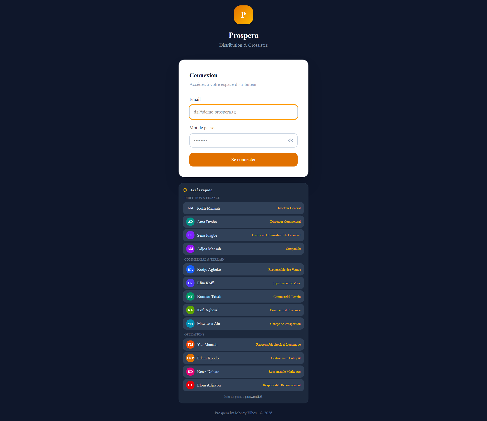

L'écran de connexion accepte un **email + mot de passe**, mais surtout il propose un panneau
**« Accès rapide »** qui liste tous les comptes de démonstration, regroupés par famille de métier
(Direction & Finance, Commercial & Terrain, Opérations). Un clic connecte instantanément dans la
peau du rôle choisi — idéal pour une démonstration.

- **URL de l'application :** `http://localhost:3002`
- **Mot de passe universel de démo :** `password123`

| Email | Rôle |
|-------|------|
| `dg@demo.prospera.tg` | Directeur Général |
| `dc@demo.prospera.tg` | Directeur Commercial |
| `ventes@demo.prospera.tg` | Responsable des Ventes |
| `superviseur@demo.prospera.tg` | Superviseur de Zone |
| `commercial@demo.prospera.tg` | Commercial Terrain |
| `freelance@demo.prospera.tg` | Commercial Freelance |
| `prospection@demo.prospera.tg` | Chargé de Prospection |
| `stock@demo.prospera.tg` | Responsable Stock & Logistique |
| `entrepot@demo.prospera.tg` | Gestionnaire Entrepôt |
| `daf@demo.prospera.tg` | Directeur Administratif & Financier |
| `comptable@demo.prospera.tg` | Comptable |
| `marketing@demo.prospera.tg` | Responsable Marketing |
| `recouvrement@demo.prospera.tg` | Responsable Recouvrement |

---

## 4. Navigation, rôles et périmètres

Une **barre latérale** permanente organise les modules en quatre familles : **Opérations**,
**Commercial**, **Automatisation** et **Pilotage**. Elle s'adapte à chaque rôle :

- **Le menu est filtré** : chacun ne voit que les modules auxquels il a droit. Un gestionnaire
  d'entrepôt ne verra ni « Objectifs » ni « Comptabilité ».
- **Les libellés changent selon le poste** : « Points de vente » pour le siège devient « Mes clients »
  pour un commercial, « Mon portefeuille » pour un freelance, « Clients débiteurs » pour le recouvrement.
- **Des pastilles rouges** signalent le travail en attente : relances critiques, commandes à valider,
  proformas qui expirent, actions d'automatisation à arbitrer, bons de préparation du jour.
- **En bas**, la carte de l'utilisateur (initiales colorées par rôle, nom, fonction) et le bouton
  de déconnexion.

Le contrôle d'accès est appliqué à deux niveaux (menu **et** URL) : taper une adresse à la main ne
permet pas de contourner ses droits. La table d'accès par rôle est la **source de vérité unique** du produit.

---

## 5. Les tableaux de bord (un cockpit par métier)

Chaque rôle atterrit sur un tableau de bord conçu pour **sa** première décision de la journée.
En voici les plus représentatifs.

### 5.1 Directeur Général — « Pilotage Direction Générale »

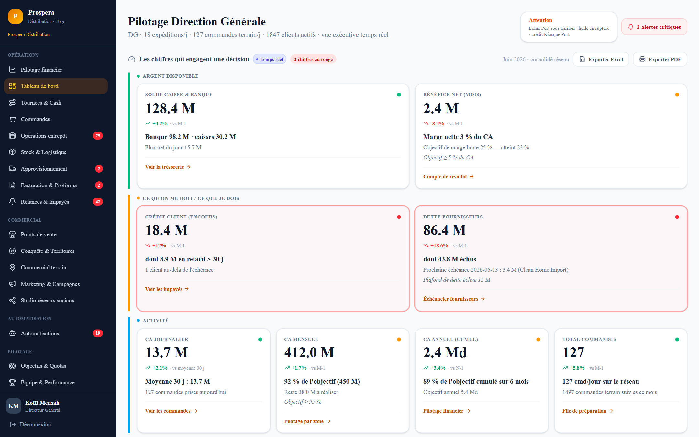

La vue exécutive temps réel. Elle est volontairement organisée par **question de décision** et non
par service :

- **Argent disponible** : solde caisse & banque, bénéfice net du mois, marge nette vs objectif.
- **Ce qu'on me doit / ce que je dois** : encours crédit client (avec la part en retard > 30 j) face
  à la dette fournisseurs (avec la part échue) — l'équilibre de trésorerie d'un coup d'œil.
- **Activité** : CA journalier, mensuel, annuel cumulé et nombre de commandes.
- En haut à droite, un bandeau **alertes critiques** (ex. « Lomé Port sous tension ») et des boutons
  d'**export Excel / PDF** pour le reporting.

### 5.2 Commercial Terrain — « Bonjour Komlan »

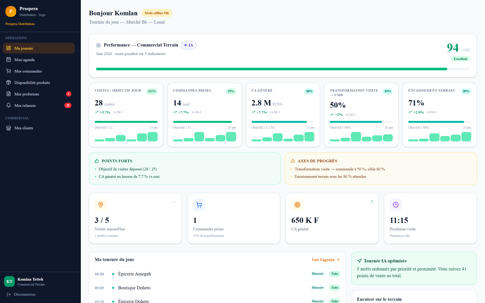

Un cockpit personnel et motivant, pensé pour le mobile et le mode hors-ligne (badge *Mode offline OK*) :

- Un **score de performance IA sur 100** avec les indicateurs pondérés (visites/objectif, commandes
  prises, CA généré, taux de transformation visite → commande, encaissement terrain).
- Les **points forts** et **axes de progrès** rédigés en clair.
- La **tournée du jour optimisée par l'IA** (ordre des arrêts par priorité et proximité) et la prochaine visite.

### 5.3 Responsable Marketing — « Cockpit marketing »

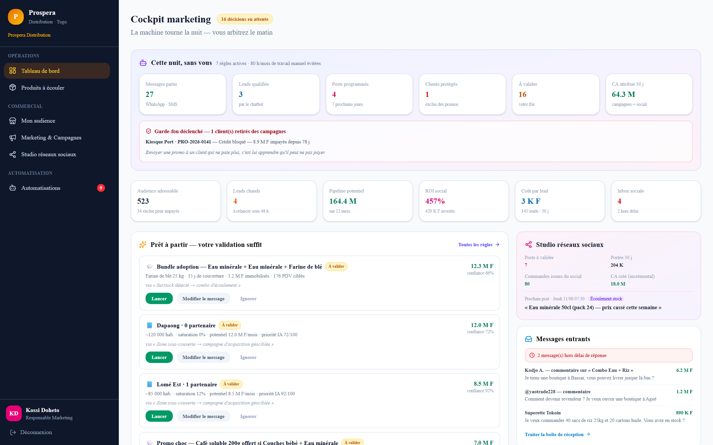

Titre parlant : *« La machine tourne la nuit — vous arbitrez le matin »*. On y trouve le bloc
**« Cette nuit, sans vous »** (messages partis, leads qualifiés par le chatbot, posts programmés),
un **garde-fou** qui a retiré un mauvais payeur d'une campagne, le pipeline de leads, le ROI social,
et une file **« Prêt à partir — votre validation suffit »** de combos d'écoulement.

### 5.4 Recouvrement — « Cockpit recouvrement »

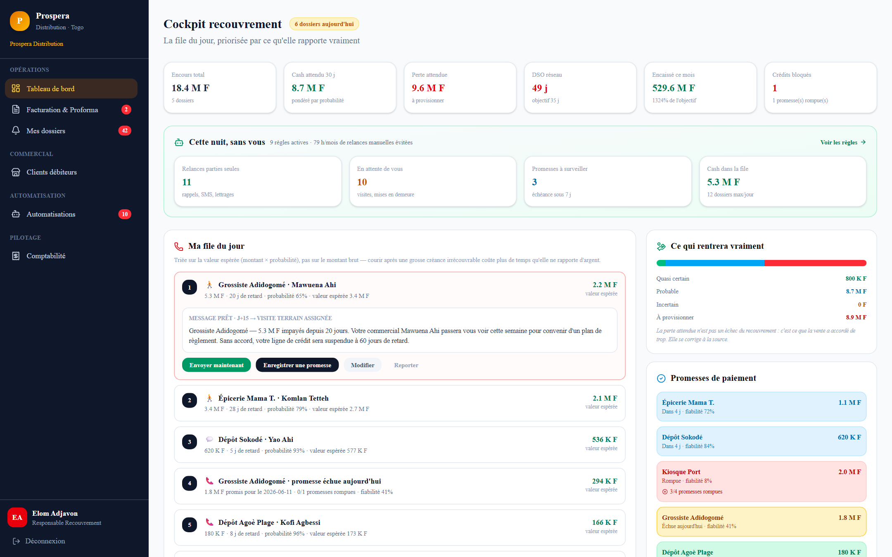

La file du jour **priorisée par la valeur réellement récupérable** (montant × probabilité), pas par
le montant brut. Chaque dossier propose un **message déjà rédigé** et des actions immédiates (Envoyer,
Enregistrer une promesse, Reporter). À droite, le suivi des **promesses de paiement** et leur fiabilité.

### 5.5 Responsable Stock & Logistique — « Pilotage stock & logistique »

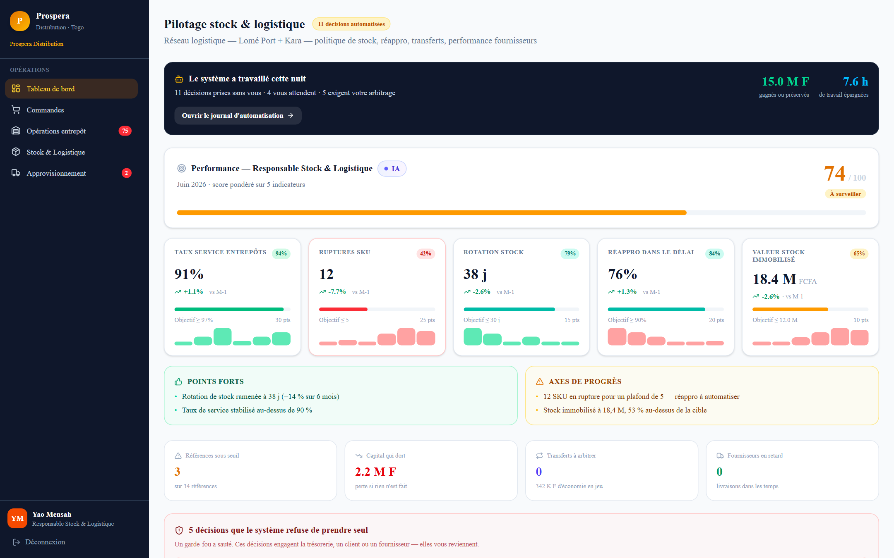

Ouvre sur **« Le système a travaillé cette nuit »** (décisions prises seul, en attente, à arbitrer,
temps gagné). Puis un score de performance (taux de service, ruptures SKU, rotation, réappro dans les
délais, valeur de stock immobilisé) et un rappel des **décisions que le système refuse de prendre seul**.

### 5.6 Gestionnaire d'Entrepôt — « Entrepôt Lomé Port »

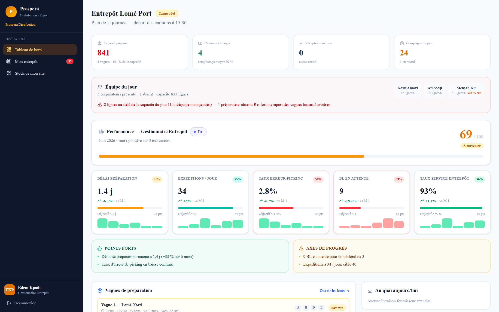

Le plan de la journée d'un site physique : lignes à préparer, camions à charger, réceptions au quai,
comptages, équipe présente, et un score de performance entrepôt (délai de préparation, expéditions/jour,
taux d'erreur picking, BL en attente, taux de service).

### 5.7 Directeur Administratif & Financier — « Direction financière »

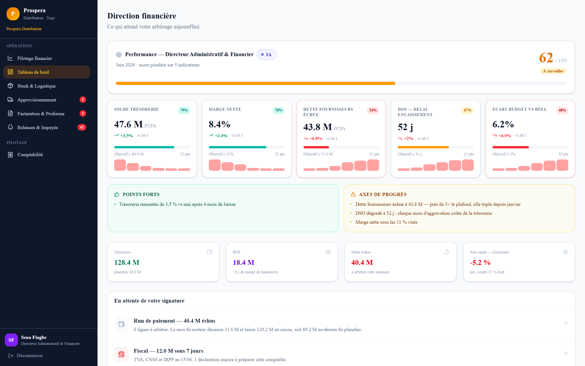

*« Ce qui attend votre arbitrage aujourd'hui »* : score financier (solde de trésorerie, marge nette,
dette fournisseurs échue, DSO, écart budget vs réel) et une file **« En attente de votre signature »**
(run de paiement, échéances fiscales).

---

## 6. Pilotage & Finance

### 6.1 Pilotage financier

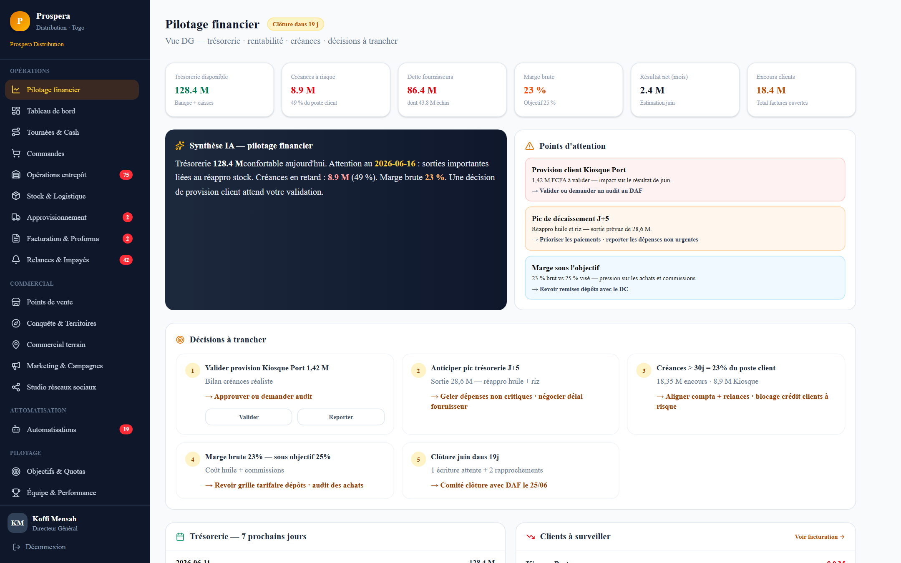

**Qui ?** DG, Directeur Commercial, DAF. **À quoi ça sert ?** Piloter la trésorerie et la rentabilité
et **trancher les décisions financières**.

- Bandeau de KPI : trésorerie disponible, créances à risque, dette fournisseurs échue, marge brute,
  résultat net, encours clients.
- Une **synthèse IA** en langage naturel (« Trésorerie confortable aujourd'hui. Attention aux sorties
  du 16… ») accompagnée des **points d'attention**.
- Un bloc central **« Décisions à trancher »** numéroté : valider une provision, anticiper un pic de
  décaissement, aligner compta + relances sur les créances > 30 j, préparer la clôture… chaque décision
  a un bouton d'action (Valider / Reporter).
- Une projection de **trésorerie sur 7 jours** et une liste de **clients à surveiller**.

### 6.2 Comptabilité

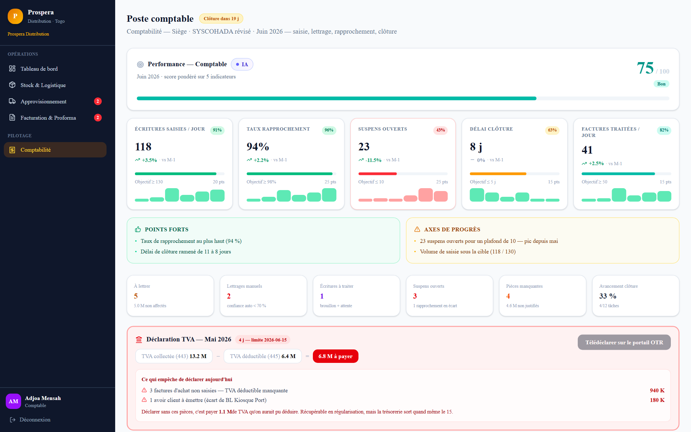

**Qui ?** Comptable, DAF, DG, Recouvrement. **Référentiel :** SYSCOHADA révisé.

- Score de performance comptable (écritures saisies/jour, taux de rapprochement, suspens ouverts,
  délai de clôture, factures traitées) avec **points forts** et **axes de progrès**.
- Compteurs opérationnels : à lettrer, lettrages manuels, écritures à traiter, suspens, pièces
  manquantes, avancement clôture.
- Un bloc **Déclaration TVA** qui calcule la TVA à payer **et signale ce qui empêche de déclarer
  aujourd'hui** (factures d'achat non saisies, avoir à émettre) — avec le montant de TVA récupérable
  en jeu et un bouton *Télédéclarer sur le portail OTR*.

Le module comporte aussi les onglets **Factures d'achat** et une vue dédiée au DG.

---

## 7. Clients, terrain & conquête (CRM)

### 7.1 Points de vente (réseau clients & magasins)

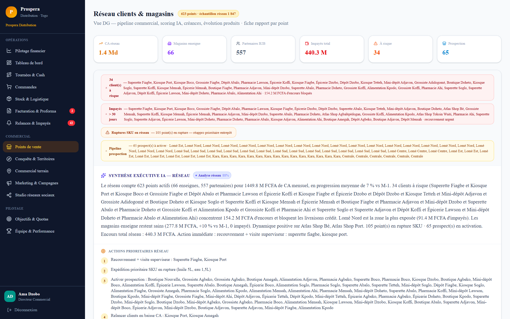

Le **CRM du distributeur**. Selon le rôle, il s'appelle « Mes clients », « Mon portefeuille », « Mon
audience » ou « Clients débiteurs ». La vue Direction affiche :

- Les grands compteurs réseau : CA, magasins enseigne, partenaires B2B, impayés total, points à
  risque, prospection.
- Des **bandeaux d'alerte agrégés** (clients à risque, impayés > 30 j, ruptures SKU en réseau, pipeline
  de prospection).
- Une **synthèse exécutive IA** du réseau et une liste d'**actions prioritaires** classées.

### 7.2 Fiche point de vente

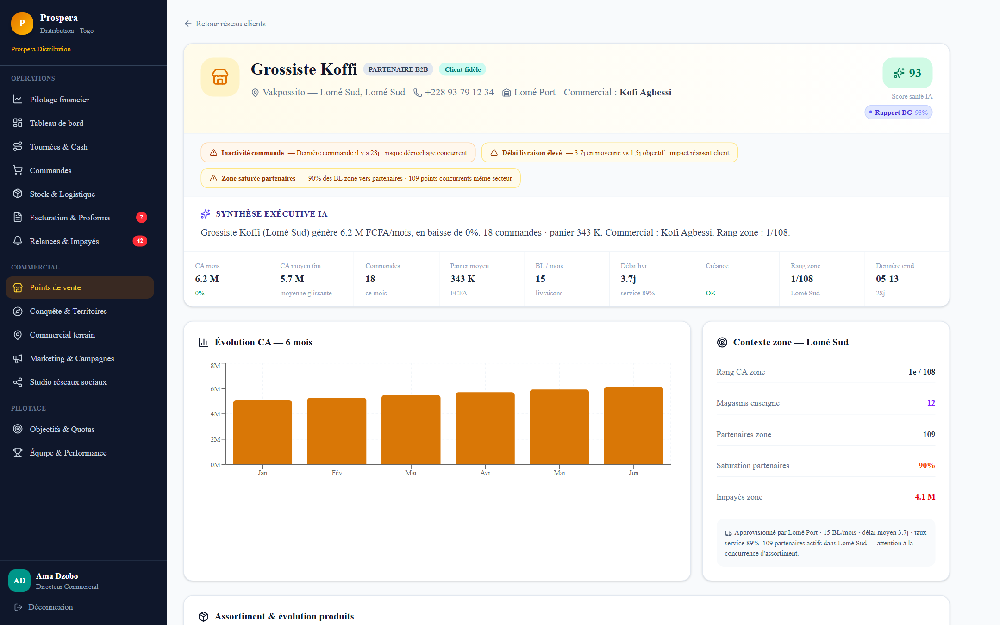

En cliquant sur un client, on ouvre sa fiche complète :

- En-tête : type de partenaire, statut (client fidèle…), coordonnées, commercial en charge, et un
  **score de santé IA** (ex. 93/100).
- Des **alertes contextuelles** : inactivité commande, délai de livraison élevé, zone saturée en partenaires.
- Une **synthèse IA** du compte, ses KPIs (CA, panier moyen, BL/mois, délai livraison, créance, rang zone).
- Un **graphique d'évolution du CA sur 6 mois**, le **contexte de la zone** (rang, saturation, impayés)
  et l'**assortiment / évolution produits**.

### 7.3 Conquête & Territoires (prospection)

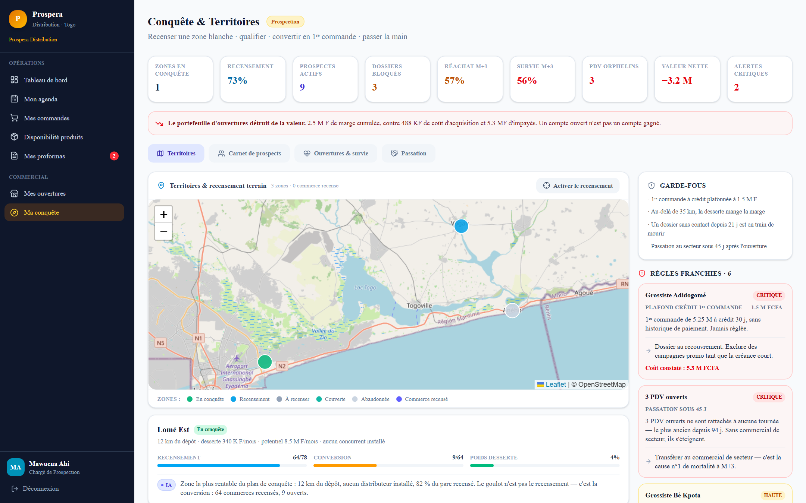

**Qui ?** Chargé de prospection (et l'encadrement en consultation). Objectif : *recenser une zone
blanche → qualifier → convertir en 1ʳᵉ commande → passer la main au commercial de secteur*.

- KPIs de conquête : zones en conquête, taux de recensement, prospects actifs, dossiers bloqués,
  réachat M+1, survie M+3, PDV orphelins, valeur nette, alertes.
- Un avertissement clé : *« Un compte ouvert n'est pas un compte gagné »* (le coût d'acquisition et
  les impayés peuvent détruire la valeur).
- Onglets **Territoires / Carnet de prospects / Ouvertures & survie / Passation**.
- Une **carte interactive** (OpenStreetMap) des territoires avec code couleur (en conquête, à recenser,
  couverte, abandonnée, commerce recensé).
- Un panneau **garde-fous** (plafond 1ʳᵉ commande, distance max, délai sans contact) et les **règles
  franchisées** critiques.

### 7.4 Commercial terrain (supervision)

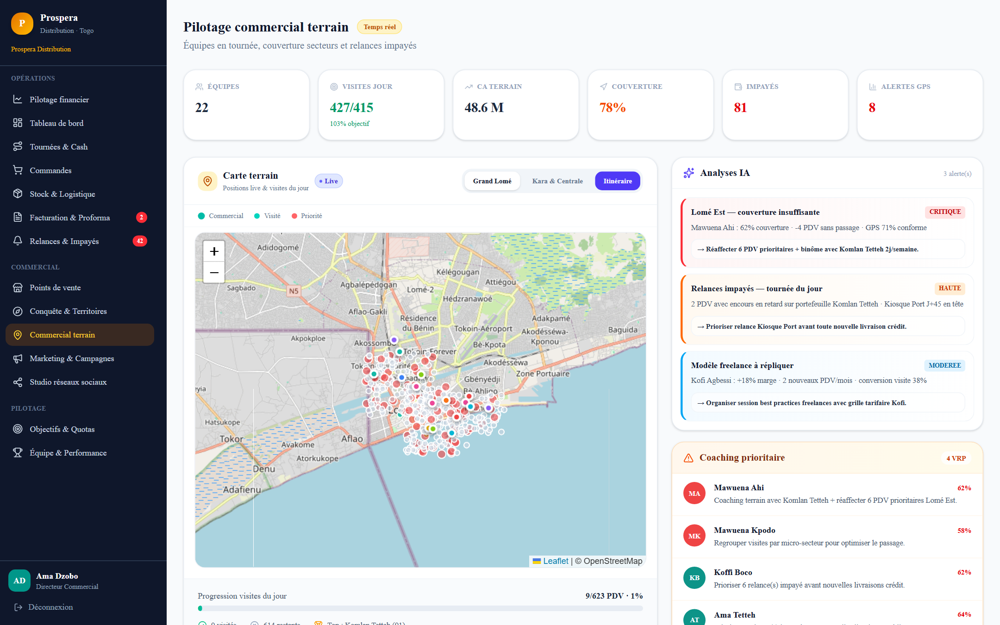

**Qui ?** L'encadrement (DG, DC, Responsable des Ventes, Superviseur). C'est la **vue de supervision
GPS** de toute l'équipe :

- Compteurs : équipes en tournée, visites du jour vs objectif, CA terrain, couverture, impayés, alertes GPS.
- Une **carte live** des positions et visites du jour (commercial / visité / prioritaire).
- Des **analyses IA** (couverture insuffisante sur une zone, tournée de recouvrement du jour, modèle
  freelance à répliquer) et un bloc **coaching prioritaire** par VRP.

### 7.5 Tournées & Cash

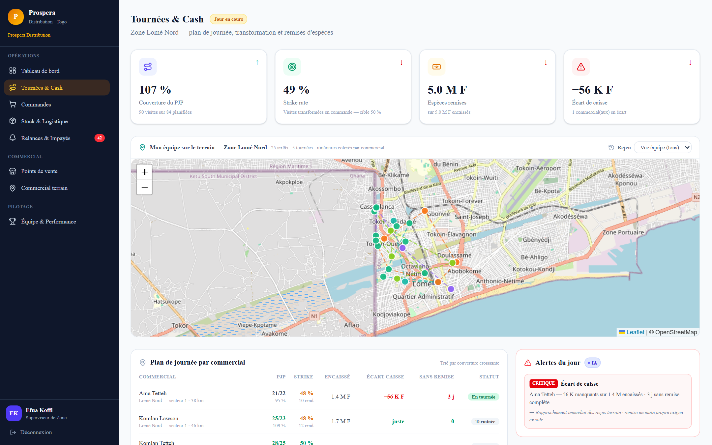

**Qui ?** DG, DC, Superviseur — c'est l'écran du **chef d'équipe**.

- Couverture du plan de tournée (PJP), **strike rate** (visites transformées en commande), **espèces
  remises** et **écart de caisse**.
- Une **carte de l'équipe sur le terrain** (itinéraires colorés par commercial).
- Un **plan de journée par commercial** (PJP, strike, encaissé, écart caisse, remises) et des **alertes
  du jour** (ex. écart de caisse critique → rapprochement immédiat exigé).

### 7.6 Mon agenda / Mon activité (terrain)

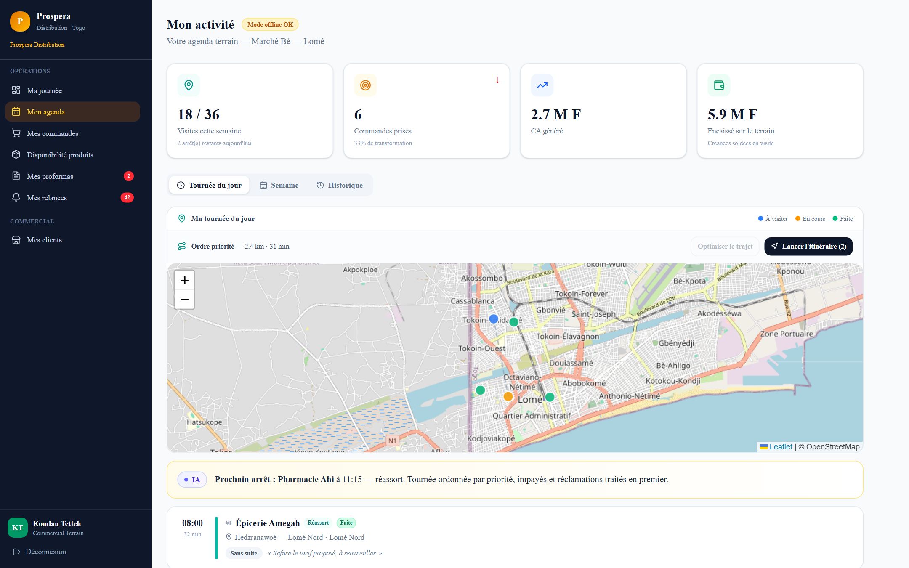

**Qui ?** Commercial, Freelance, Prospection. L'agenda terrain du vendeur, **utilisable hors-ligne** :

- Visites de la semaine, commandes prises, CA généré, encaissé sur le terrain.
- Onglets **Tournée du jour / Semaine / Historique**.
- La **tournée du jour cartographiée** avec ordre de priorité, bouton *Lancer l'itinéraire* et une
  suggestion IA du prochain arrêt (réassort, impayés et réclamations traités en premier).
- La liste horodatée des arrêts avec compte-rendu de visite.

---

## 8. Ventes, commandes & encaissement

### 8.1 Commandes

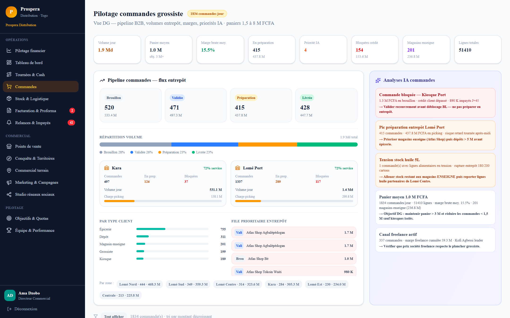

**Qui ?** Direction et force de vente (renommé « Mes commandes » côté terrain). La vue Direction pilote
le **carnet de commandes grossiste** :

- Volume jour, panier moyen, marge brute, en préparation, priorité IA, commandes bloquées crédit,
  magasins enseigne, lignes totales.
- Un **pipeline** Brouillon → Validée → Préparation → Livrée, avec répartition des volumes et découpage
  par entrepôt (Kara, Lomé Port) et par type de client / zone.
- Des **analyses IA** : commande bloquée (débloquer le recouvrement avant préparation), pic de préparation
  entrepôt, tension sur une référence, panier moyen…

### 8.2 Disponibilité produits

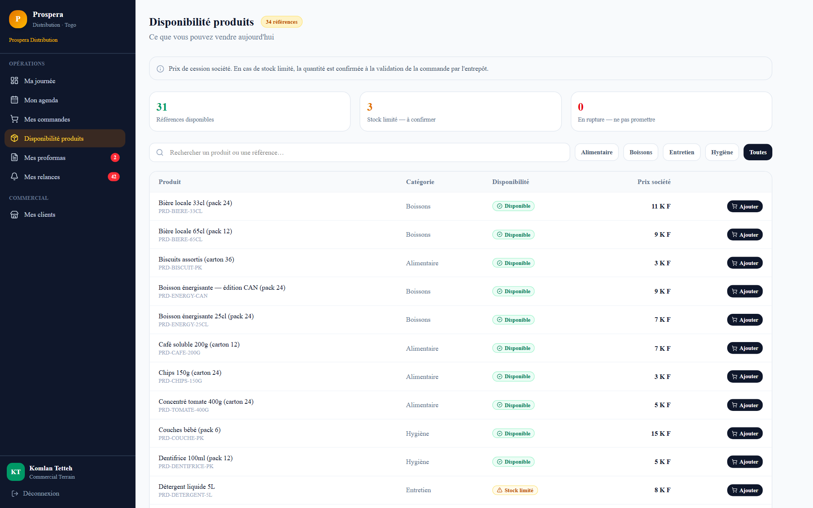

**Qui ?** Commercial, Freelance, Prospection. *« Ce que vous pouvez vendre aujourd'hui »* — le catalogue
de prise de commande sur le terrain :

- Compteurs : références disponibles, stock limité (à confirmer), en rupture (à ne pas promettre).
- Recherche et filtres par catégorie (Alimentaire, Boissons, Entretien, Hygiène).
- Un tableau produit avec **disponibilité en temps réel** (Disponible / Stock limité) et le **prix de
  cession société**, plus un bouton **Ajouter** au panier. Le stock limité est confirmé à la validation
  par l'entrepôt.

### 8.3 Facturation & Proforma

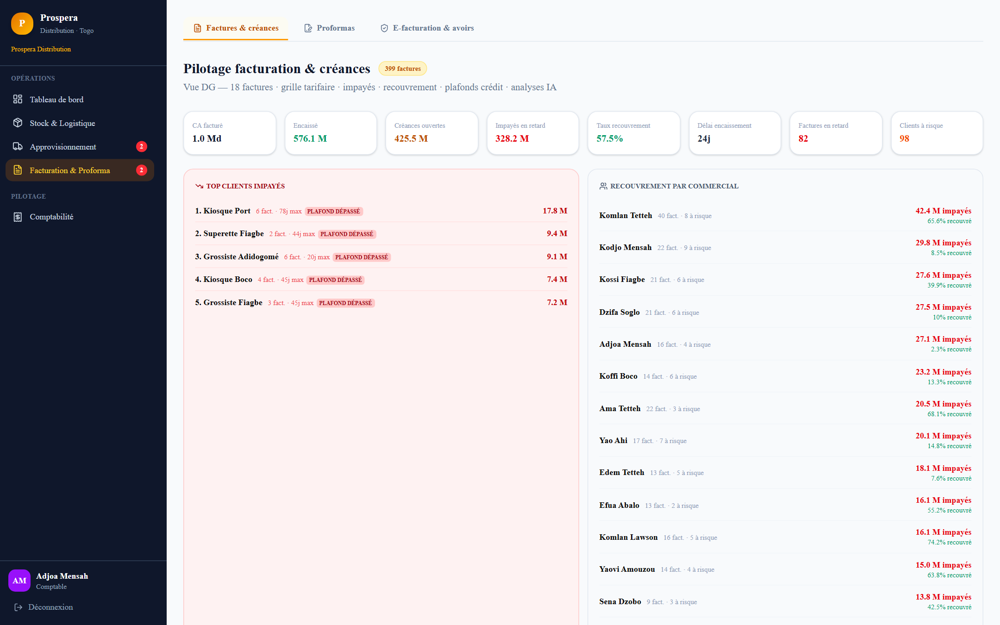

**Qui ?** Direction commerciale, force de vente, DAF, Comptable, Recouvrement. Trois onglets :
**Factures & créances**, **Proformas**, **E-facturation & avoirs**.

- KPIs : CA facturé, encaissé, créances ouvertes, impayés en retard, taux de recouvrement, délai
  d'encaissement, factures en retard, clients à risque.
- **Top clients impayés** avec signalement **« plafond dépassé »**.
- **Recouvrement par commercial** (montant impayé et taux de recouvrement de chacun).
- Le module gère aussi les **proformas** (avec alerte d'expiration — pastille dans le menu), un
  **constructeur de proforma** et l'aperçu de document.

### 8.4 Relances & Impayés (recouvrement)

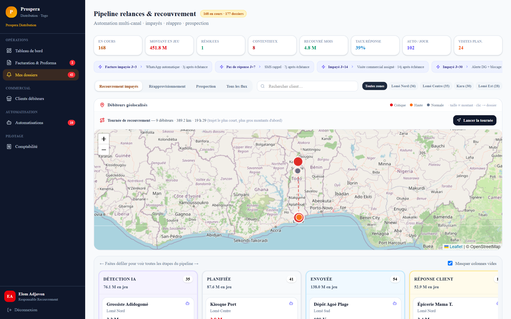

**Qui ?** DG, DC, Responsable des Ventes, Superviseur, Commercial, DAF, Recouvrement. Le **pipeline
multi-canal** de recouvrement, automatisé :

- Compteurs : dossiers en cours, montant en jeu, résolus, contentieux, recouvré du mois, taux de réponse,
  actions automatiques du jour, visites planifiées.
- Des **règles d'escalade** visibles (Facture impayée J+3 → WhatsApp auto ; Pas de réponse J+7 → SMS ;
  J+14 → visite commercial ; J+30 → alerte DG / blocage).
- Une **carte des débiteurs géolocalisés** et une **tournée de recouvrement optimisée** (trajet le plus
  court, plus gros montants d'abord) avec bouton *Lancer la tournée*.
- Un **pipeline en colonnes** : Détection IA → Planifiée → Envoyée → Réponse client…

---

## 9. Logistique, stock & approvisionnement

### 9.1 Opérations entrepôt

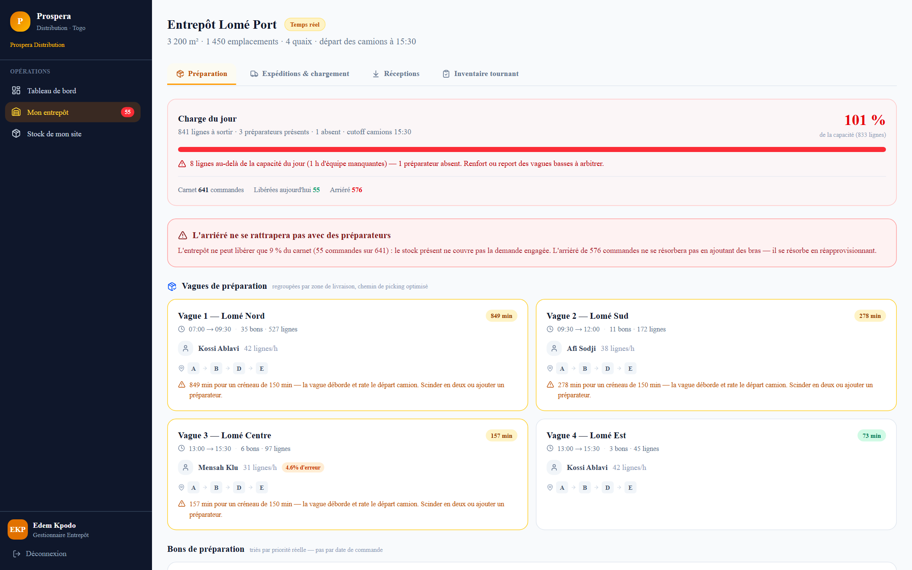

**Qui ?** Gestionnaire d'entrepôt (qui y « vit »), Responsable Stock (qui supervise), DG. Le **poste de
travail physique** du quai, avec 4 onglets : **Préparation, Expéditions & chargement, Réceptions,
Inventaire tournant**.

- Une jauge **« Charge du jour »** (lignes à sortir vs capacité) qui alerte quand l'entrepôt est en
  surcharge et **explique** que l'arriéré ne se résorbe pas en ajoutant des bras (c'est un problème de réappro).
- Les **vagues de préparation** regroupées par zone de livraison avec chemin de picking optimisé,
  préparateur affecté, durée estimée et alerte de dépassement du départ camion.
- Les **bons de préparation** triés par priorité réelle.

### 9.2 Stock & Logistique

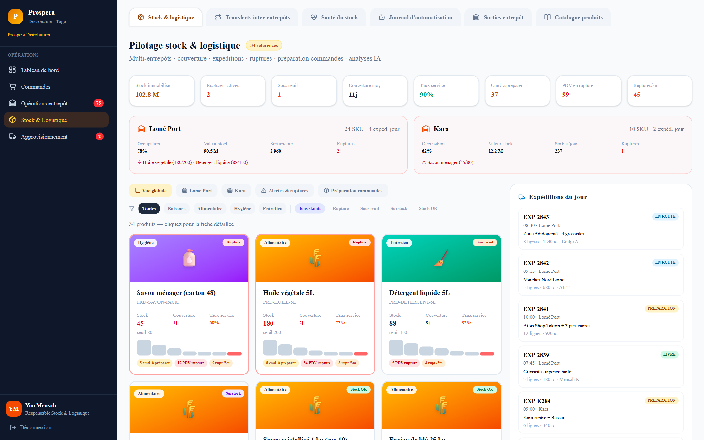

**Qui ?** Direction, Responsable Stock, Gestionnaire (renommé « Stock de mon site »), Marketing
(« Produits à écouler »). Vue multi-entrepôts avec onglets : **Stock & logistique, Transferts
inter-entrepôts, Santé du stock, Journal d'automatisation, Sorties entrepôt, Catalogue produits**.

- KPIs : stock immobilisé, ruptures actives, sous seuil, couverture moyenne, taux de service,
  commandes à préparer, PDV en rupture.
- Une carte par entrepôt (Lomé Port, Kara) avec occupation, valeur de stock, sorties/jour, ruptures.
- Des **fiches produit** visuelles avec stock, couverture, taux de service, mini-historique et badges
  (Rupture, Sous seuil, Surstock, Stock OK).
- Un panneau **Expéditions du jour** avec statut (En route, Préparation, Livré).

### 9.3 Approvisionnement

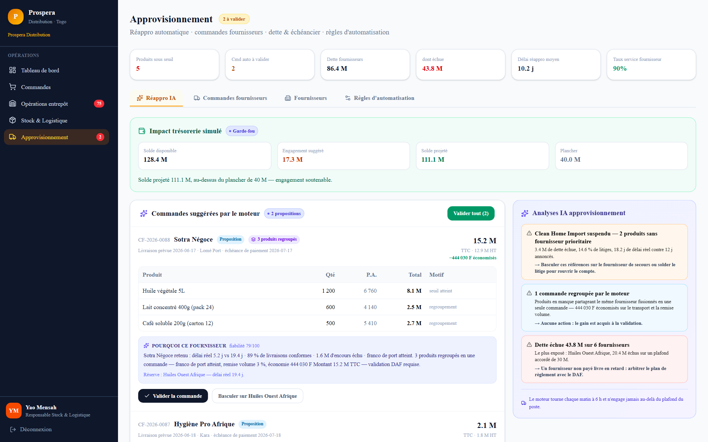

**Qui ?** DG, Responsable Stock, DAF, Comptable. Le **réappro assisté par IA** et la relation
fournisseurs. Onglets : **Réappro IA, Commandes fournisseurs, Fournisseurs, Règles d'automatisation**.

- KPIs : produits sous seuil, commandes à valider, dette fournisseurs (dont échue), délai réappro
  moyen, taux de service fournisseur.
- Un simulateur **« Impact trésorerie »** avec garde-fou : engagement suggéré vs plancher de trésorerie,
  pour ne jamais mettre la caisse en danger.
- Des **commandes suggérées par le moteur** (produits regroupés par fournisseur pour atteindre le franco
  de port, remises volume) avec un encart **« Pourquoi ce fournisseur »** (fiabilité, délai réel,
  encours échu) et un bouton *Valider la commande* ou *Basculer sur un autre fournisseur*.
- Des **analyses IA** (fournisseur suspendu, économies par regroupement, dette échue à arbitrer).

---

## 10. Marketing & automatisation

### 10.1 Marketing & Campagnes

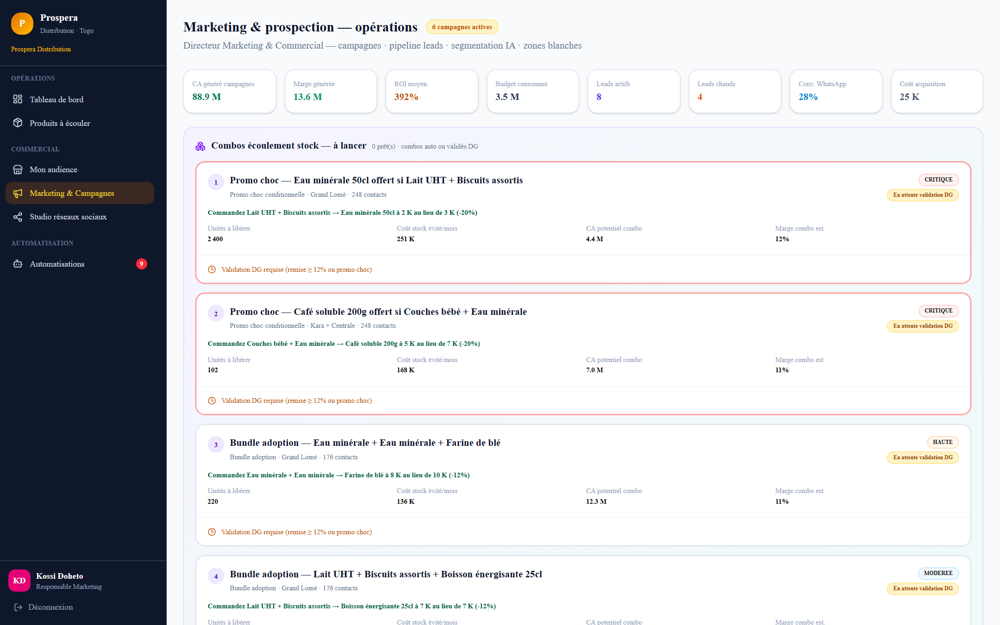

**Qui ?** DG, DC, Marketing. Pilotage des campagnes et de l'écoulement de stock :

- KPIs : CA généré par campagnes, marge générée, ROI moyen, budget consommé, leads actifs/chauds,
  conversion WhatsApp, coût d'acquisition.
- Le cœur du module : les **combos d'écoulement stock à lancer** — l'IA détecte un dormant/surstock et
  propose une promo choc (« Produit offert si achat de X + Y ») avec unités à libérer, coût de stock
  évité, CA potentiel et marge estimée. Les remises importantes exigent une **validation DG**.

### 10.2 Studio réseaux sociaux

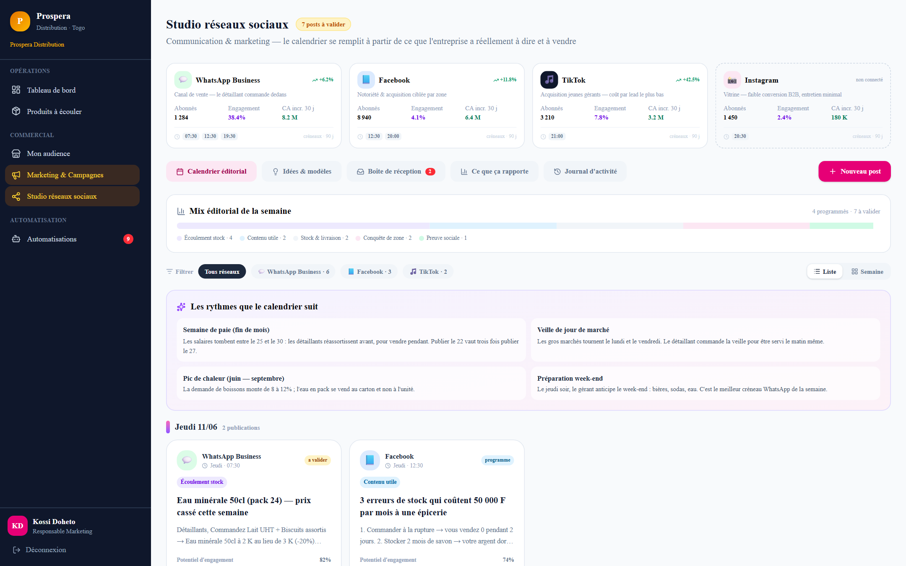

**Qui ?** DG (en consultation), DC, Marketing. Un **calendrier éditorial** qui se remplit à partir de
ce que l'entreprise a réellement à dire et à vendre :

- Un tableau de bord par réseau (WhatsApp Business, Facebook, TikTok, Instagram) avec abonnés,
  engagement et CA à 30 jours attribué.
- Onglets **Calendrier éditorial / Idées & modèles / Boîte de réception / Ce que ça rapporte / Journal
  d'activité** + bouton **Nouveau post**.
- Un **mix éditorial de la semaine** (écoulement stock, contenu utile, conquête de zone, preuve sociale)
  et les **rythmes commerciaux** que le calendrier suit (semaine de paie, veille de jour de marché, pic
  de chaleur, préparation week-end).
- Des posts **déjà rédigés** avec potentiel d'engagement, en attente de validation ou programmés.

### 10.3 Automatisations

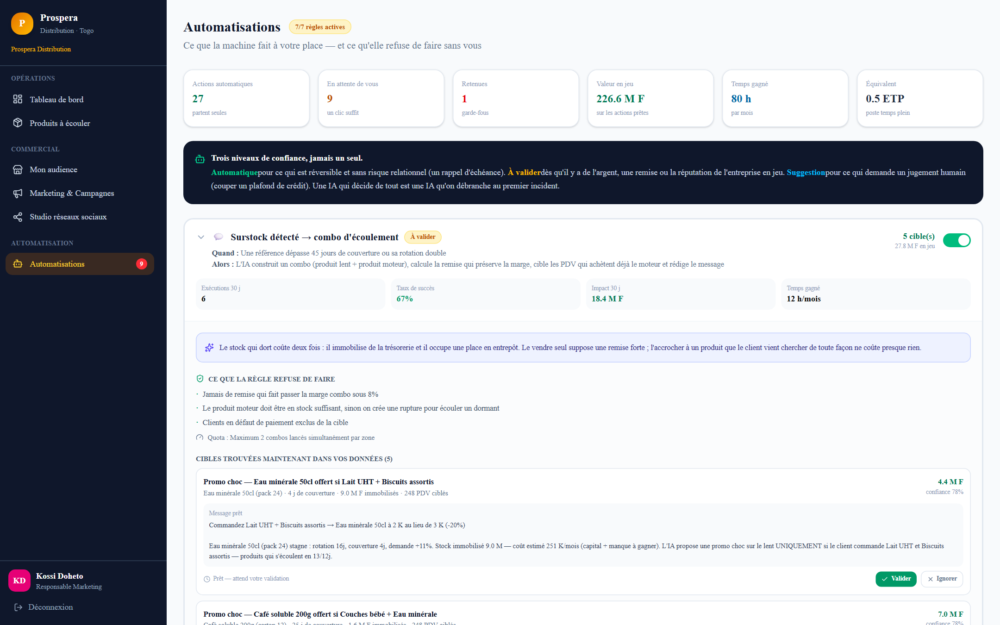

**Qui ?** DG, Marketing, Recouvrement. Le **centre de contrôle du moteur d'IA** : *« Ce que la machine
fait à votre place — et ce qu'elle refuse de faire sans vous »*.

- KPIs : actions automatisées (parties seules), en attente de vous, retenues (garde-fou), valeur en
  jeu, temps gagné, équivalent temps plein (ETP).
- Le rappel des **trois niveaux de confiance** (Automatique / À valider / Suggestion).
- Chaque **règle** est détaillée : son déclencheur (« Quand… »), son action (« Alors… »), ses stats
  (exécutions 30 j, taux de succès, impact, temps gagné), et surtout **« ce que la règle refuse de faire »**
  (ex. jamais de remise qui fait passer la marge combo sous 8 %, exclure les mauvais payeurs…).
- Les **cibles trouvées maintenant dans vos données**, avec message prêt et boutons **Valider / Ignorer**.

---

## 11. Objectifs & performance des équipes

### 11.1 Objectifs & Quotas

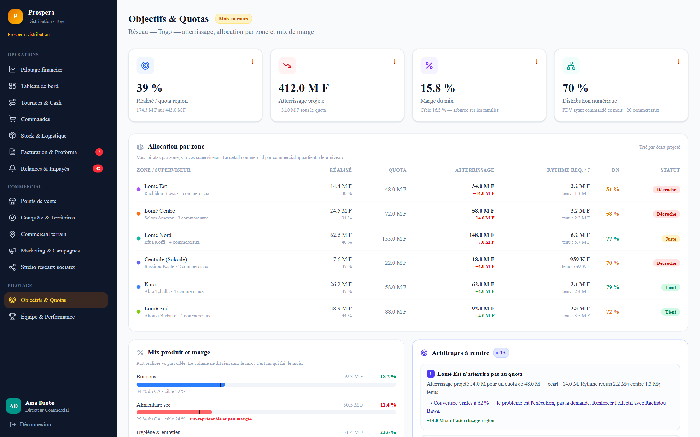

**Qui ?** DG, DC, Responsable des Ventes. L'**allocation du quota par zone**, l'atterrissage et le mix
de marge — des décisions de niveau région :

- KPIs : réalisé/quota région, atterrissage projeté, marge du mix, distribution numérique.
- Un tableau **allocation par zone** (réalisé, quota, atterrissage, rythme requis/jour, distribution
  numérique, statut *Tient / Juste / Décroche*).
- Un **mix produit et marge** (part réalisée vs part cible par famille) et des **arbitrages à rendre**
  proposés par l'IA (« Lomé Est n'atterrira pas au quota → le problème est l'exécution, pas la demande »).

### 11.2 Équipe & Performance

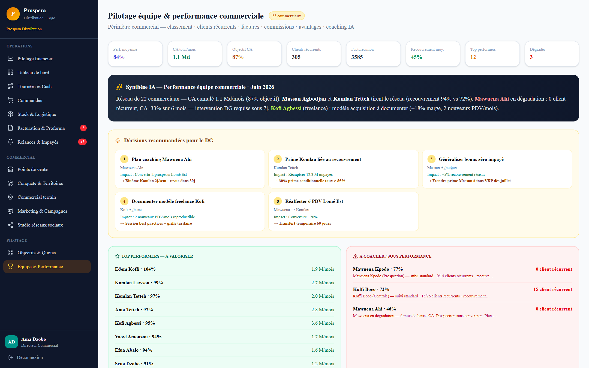

**Qui ?** DG, DC, Responsable des Ventes, Superviseur. Le pilotage de la **performance commerciale** :

- KPIs : performance moyenne, CA total/mois, objectif CA, clients récurrents, factures/mois,
  recouvrement moyen, top performers, commerciaux en difficulté.
- Une **synthèse IA** qui nomme les leaders et ceux en dégradation (« intervention DG requise sous 7 j »).
- Des **décisions recommandées pour le DG** (plan de coaching, prime liée au recouvrement, généraliser
  un bonus zéro impayé, réaffecter des PDV…).
- Deux classements : **Top performers à valoriser** et **À coacher / sous-performance**.

---

## 12. Argumentaire de vente (pitch commercial)

Pour présenter Prospera à un distributeur, appuyez-vous sur ces messages :

**1. « Prospera ne vous montre pas le passé, il prépare votre journée. »**
Chaque cockpit s'ouvre sur *« Cette nuit, sans vous : … »*. Le dirigeant arrive le matin devant une
file de décisions déjà instruites, pas devant un tableau de chiffres à décrypter.

**2. « L'IA travaille, mais elle ne dérape jamais. »**
Les garde-fous (plafond de crédit, plancher de trésorerie, remise maximale, exclusion des mauvais
payeurs) sont dans le produit. La machine agit seule uniquement sur ce qui est réversible et sans
risque ; le reste attend un clic. Argument décisif face à la peur de « l'IA qui fait n'importe quoi ».

**3. « Un outil par métier, une seule vérité. »**
13 rôles, chacun avec son cockpit et son périmètre, mais des données partagées et cohérentes. Le
commercial, l'entrepôt, la compta et le DG parlent enfin le même langage.

**4. « Conçu pour le terrain togolais. »**
Mode hors-ligne pour les commerciaux, remises d'espèces et écarts de caisse, cartes géolocalisées des
tournées et des débiteurs, TVA SYSCOHADA et portail OTR, WhatsApp comme canal de vente et de relance,
franco de port fournisseurs, zones blanches à conquérir.

**5. « Ça se voit, ça se démontre en 10 minutes. »**
Le panneau *Accès rapide* de la connexion permet de sauter d'un rôle à l'autre instantanément : montrez
le DG, puis le commercial, puis le recouvrement — l'effet « waouh » est immédiat.

**Chiffres de valeur mis en avant par le produit (démo)** : temps gagné mensuel, équivalent ETP,
valeur en jeu sécurisée, relances manuelles évitées, économies par regroupement de commandes fournisseurs.

---

## 13. Questions fréquentes

**Est-ce que chaque utilisateur voit toutes les données ?**
Non. Le menu **et** les URLs sont filtrés par rôle, et les chiffres sont bornés au périmètre
(zone, entrepôt, portefeuille) de la personne connectée.

**L'IA peut-elle envoyer une remise ou bloquer un client toute seule ?**
Seulement dans les limites des garde-fous. Une remise qui entame trop la marge, un déblocage de crédit
ou toute action « à risque » est mise en file **« À valider »** et attend une décision humaine.

**Les montants du guide sont-ils réels ?**
Non, ce sont des données de démonstration en FCFA. Elles servent à illustrer le fonctionnement.

**Sur quels canaux Prospera communique-t-il avec les clients finaux ?**
WhatsApp Business, SMS, Facebook, TikTok, Instagram — orchestrés depuis le Studio réseaux sociaux et
le moteur d'automatisation (relances, campagnes).

**Comment lancer l'application en local ?**
```bash
cd prospera-distributeur
npm install
npm run dev
# puis ouvrir http://localhost:3002
```

---

> *Prospera by Money Vibes — Distribution & Grossistes · Togo.*
> *Guide généré à partir de l'environnement de démonstration ; captures d'écran réelles de l'application.*
